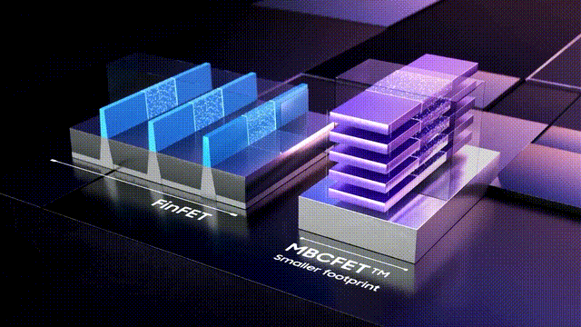

# 电气工程

**电气工程**是以[电子学](https://zh.wikipedia.org/wiki/%E9%9B%BB%E5%AD%90%E5%AD%B8 "电子学")、[电磁学](https://zh.wikipedia.org/wiki/%E9%9B%BB%E7%A3%81%E5%AD%B8 "电磁学")等[物理学](https://zh.wikipedia.org/wiki/%E7%89%A9%E7%90%86%E5%AD%A6 "物理学")分支为基础，涵盖[电子学](https://zh.wikipedia.org/wiki/%E9%9B%BB%E5%AD%90%E5%AD%B8 "电子学")、[电子计算机](https://zh.wikipedia.org/wiki/%E9%9B%BB%E5%AD%90%E8%A8%88%E7%AE%97%E6%A9%9F "电子计算机")、[电力工程](https://zh.wikipedia.org/wiki/%E9%9B%BB%E5%8A%9B%E5%B7%A5%E7%A8%8B "电力工程")、[电信](https://zh.wikipedia.org/wiki/%E7%94%B5%E4%BF%A1 "电信")、[控制工程](https://zh.wikipedia.org/wiki/%E6%8E%A7%E5%88%B6%E5%B7%A5%E7%A8%8B "控制工程")、[讯号处理](https://zh.wikipedia.org/wiki/%E8%A8%8A%E8%99%9F%E8%99%95%E7%90%86 "讯号处理")、[机械电子学](https://zh.wikipedia.org/wiki/%E6%9C%BA%E6%A2%B0%E7%94%B5%E5%AD%90%E5%AD%A6 "机械电子学")等子领域的一门[工程学](https://zh.wikipedia.org/wiki/%E5%B7%A5%E7%A8%8B%E5%AD%B8 "工程学")。十九世纪后半期以来，随著[电报](https://zh.wikipedia.org/wiki/%E9%9B%BB%E5%A0%B1 "电报")、[电话](https://zh.wikipedia.org/wiki/%E9%9B%BB%E8%A9%B1 "电话")、[电能](https://zh.wikipedia.org/wiki/%E9%9B%BB%E8%83%BD "电能")在供应与使用方面的商业化，该学科逐渐发展为相对独立的专业领域。

电机工程广义上涵盖该领域的分支，但在有些地方，“电气工程”（英语：Electrical Engineering）一词的意义有时不包括“[电子工程学](https://zh.wikipedia.org/wiki/%E7%94%B5%E5%AD%90%E5%B7%A5%E7%A8%8B "电子工程")”（英语：Electronic Engineering）。这个情况下，“电气工程”是指涉及到大能量的[电力系统](https://zh.wikipedia.org/wiki/%E9%9B%BB%E5%8A%9B%E7%B3%BB%E7%B5%B1 "电力系统")（如[电能传输](https://zh.wikipedia.org/wiki/%E8%BC%B8%E9%9B%BB%E7%B3%BB%E7%B5%B1 "输电系统")、重型[电机机械](https://zh.wikipedia.org/wiki/%E9%9B%BB%E6%A9%9F%E6%A9%9F%E6%A2%B0 "电机机械")及[电动机](https://zh.wikipedia.org/wiki/%E7%94%B5%E5%8A%A8%E6%9C%BA "电动机")），而“电子工程”则是指处理小信号的电子系统（如[计算机](https://zh.wikipedia.org/wiki/%E7%94%B5%E5%AD%90%E8%AE%A1%E7%AE%97%E6%9C%BA "电子计算机")和[积体电路](https://zh.wikipedia.org/wiki/%E7%A9%8D%E9%AB%94%E9%9B%BB%E8%B7%AF "积体电路")）。

另一种区分法为，电力工程师著重于电能的传输，而电子工程师则著重于利用电子讯号进行资讯的传输。这些子领域的范围有时也会重叠：例如，[电力电子学](https://zh.wikipedia.org/wiki/%E7%94%B5%E5%8A%9B%E7%94%B5%E5%AD%90%E5%AD%A6 "电力电子学")使用电力电子元件对电能进行变换和控制；又如，[智慧电网](https://zh.wikipedia.org/wiki/%E6%99%BA%E6%85%A7%E9%9B%BB%E7%B6%B2 "智慧电网")侦测电能供应者的电能供应状况与一般家庭使用者的电能使用状况，并据之调整家电用品的耗电量，以此达到节约能源、降低损耗、增强[输电网路](https://zh.wikipedia.org/wiki/%E8%BC%B8%E9%9B%BB%E7%B6%B2%E8%B7%AF "输电网路")可靠性的目的。因此，电机工程亦函盖电子工程部分领域的专业知识。

## BMS电池系统

电池管理系统，BMS（Battery Management System），是电动汽车动力电池系统的重要组成。它一方面检测收集并初步计算电池实时状态参数，并根据检测值与允许值的比较关系控制供电回路的通断；另一方面，将采集的关键数据上报给整车控制器，并接收控制器的指令，与车辆上的其他系统协调工作。

```
电动汽车用锂离子电池容量大、串并联节数多，系统复杂，加之安全性、耐久性、动力性等性能要求高、实现难度大，因此成为影响电动汽车推广普及的瓶颈。锂离子电池安全工作区域受到温度、电压窗口限制，超过该窗口的范围，电池性能就会加速衰减，甚至发生安全问题。目前，大部分车用锂离子电池，要求的可靠工作温度为，放电时-20~55°C，充电时0~45°C（对石墨负极），而对于负极LTO充电时最低温度为-30°C；工作电压一般为1.5~4.2 V左右（对于LiCoO2/C、LiNi0.8Co0.15Al0.05O2/C、LiCoxNiyMnzO2/C以及LiMn2O4/C等材料体系约2.5~4.2 V，对于LiMn2O4/Li4Ti5O12 材料体系约1.5~2.7 V，对于LiFePO4/C 材料体系约2.0~3.7 V）。

温度对锂电池性能尤其安全性具有决定性的影响，根据电极材料类型的不同，锂电池（C/LiMn2O4 ， C/LMO，C/LiCoxNiyMnzO2 ，C/NCM， C/LiFePO4 ，C/LiNi0.8Co0.15Al0.05O2， C/NCA）典型的工作温度如下：放电在-20-55℃，充电在0-45℃；负极材料为Li4Ti5O12 或者 LTO时，最低充电温度往往可以达到-30℃。

当温度过高时，会给电池的寿命造成不利影响。当温度高至一定程度，则可能造成安全问题。如图所示图1中，当温度为90~120 ℃时，SEI 膜将开始放热分解[1 ~3] ，而一些电解质体系会在较低温度下分解约69℃ [4]。当温度超过120℃，SEI 膜分解后无法保护负碳电极 ，使得 负极与有机电解质直接反应，产生可燃气体将[3] 。当温度为130 ℃，隔膜将开始熔化并关闭离子通道，使得电池的正负极暂时没有电流流动[5,6] 。当温度升高时，正极材料开始分解（LiCoO 2 开始分解约在150 ℃[7] ，LiNi0.8Co0.15Al0.05O2在约160 ℃[8,9]，LiNixCoyMnzO2 在约210℃[8]，LiMn2O4 在约265 ℃ [1] ，LiFePO4在约310℃ [7] ）并产生氧气。当温度高于200℃时，电解液会分解并产生可燃性气体[3] ，并且与由正极的分解产生的氧气剧烈反应[9] ，进而导致热失控。在0℃以下充电，会造成锂金属在负极表面形成电镀层，这会减少电池的循环寿命。[10]

过低的电压或者过放电，会导致电解液分解并产生可燃气体进而导致潜在安全风险。过高的电压或者过充电，可能导致正极材料失去活性，并产生大量的热；普通电解质在电压高于4.5 V时会分解[12]

为了解决这些问题，人们试图开发能够在非常恶劣的情况下进行工作的新电池系统，另一方面，目前商业化锂离子电池必须连接管理系统，使锂离子电池可以得到有效的控制和管理，每个单电池都在适当的条件下工作，充分保证电池的安全性、耐久性和动力性。
```

在BMS算法研究的初期SOC（state of charge）和SOS（state of safe）是最容易得到关注的算法，这两个算法的准确性能直接影响动力电池的可用性和安全性，避免车辆在行驶中抛锚，充电中过充，直接关系产品的使用和用户的安全。

### 电池管理系统定义
电池管理系统的主要任务是保证电池系统的设计性能，可以分解成如下三个方面：
1）安全性，保护电池单体或电池组免受损坏，防止出现安全事故；
2）耐久性，使电池工作在可靠的安全区域内，延长电池的使用寿命；
3）动力性，维持电池工作在满足车辆要求的状态下。锂离子电池的安全工作区域如图1所示。


```
BMS由各类传感器、执行器、控制器以及信号线等组成，为满足相关的标准或规范，BMS应该具有以下功能。

1）电池参数检测。包括总电压、总电流、单体电池电压检测（防止出现过充、过放甚至反极现象）、温度检测（最好每串电池、关键电缆接头等均有温度传感器）、烟雾探测（监测电解液泄漏等）、绝缘检测（监测漏电）、碰撞检测等。

2）电池状态估计。包括荷电状态（SOC）或放电深度（DOD）、健康状态（SOH）、功能状态（SOF）、能量状态（SOE）、故障及安全状态（SOS）等。

3）在线故障诊断。包括故障检测、故障类型判断、故障定位、故障信息输出等。故障检测是指通过采集到的传感器信号，采用诊断算法诊断故障类型，并进行早期预警。电池故障是指电池组、高压电回路、热管理等各个子系统的传感器故障、执行器故障（如接触器、风扇、泵、加热器等），以及网络故障、各种控制器软硬件故障等。电池组本身故障是指过压（过充）、欠压（过放）、过电流、超高温、内短路故障、接头松动、电解液泄漏、绝缘降低等。

4）电池安全控制与报警。包括热系统控制、高压电安全控制。BMS诊断到故障后，通过网络通知整车控制器，并要求整车控制器进行有效处理（超过一定阈值时BMS也可以切断主回路电源），以防止高温、低温、过充、过放、过流、漏电等对电池和人身的损害。

5）充电控制。BMS中具有一个充电管理模块，它能够根据电池的特性、温度高低以及充电机的功率等级，控制充电机给电池进行安全充电。

6）电池均衡。不一致性的存在使得电池组的容量小于组中最小单体的容量。电池均衡是根据单体电池信息，采用主动或被动、耗散或非耗散等均衡方式，尽可能使电池组容量接近于最小单体的容量。

7）热管理。根据电池组内温度分布信息及充放电需求，决定主动加热/散热的强度，使得电池尽可能工作在最适合的温度，充分发挥电池的性能。

8）网络通讯。BMS需要与整车控制器等网络节点通信；同时，BMS在车辆上拆卸不方便，需要在不拆壳的情况下进行在线标定、监控、自动代码生成和在线程序下载（程序更新而不拆卸产品）等，一般的车载网络均采用CAN总线技术。

9）信息存储。用于存储关键数据，如SOC、SOH、SOF、SOE、累积充放电Ah数、故障码和一致性等。车辆中的真实BMS可能只有上面提到的部分硬件和软件。每个电池单元至少应有一个电池电压传感器和一个温度传感器。对于具有几十个电池的电池系统，可能只有一个BMS控制器，或者甚至将BMS功能集成到车辆的主控制器中。对于具有数百个电池单元的电池系统，可能有一个主控制器和多个仅管理一个电池模块的从属控制器。对于每个具有数十个电池单元的电池模块，可能存在一些模块电路接触器和平衡模块，并且从控制器像测量电压和电流一样管理电池模块，控制接触器，均衡电池单元并与主控制器通信。根据所报告的数据，主控制器将执行电池状态估计，故障诊断，热管理等。

10）电磁兼容。由于电动车使用环境恶劣，要求BMS具有好的抗电磁干扰能力，同时要求BMS对外辐射小。
```
#### BMS关键问题

##### **电池电压测量（CVM）**
1）电动汽车的电池组有数百个电芯的串联连接，需要许多通道来测量电压。由于被测量的电池电压有累积电势，而每个电池的积累电势都不同，这使得它不可能采用单向补偿方法消除误差。

图3 OCV曲线和每毫伏电压的SOC的变化（在25℃测量，休息时间3小时）

2）电压测量需要高精度（特别是对于C / LiFePO 4 电池）。
SOC估算对电池电压精度提出了很高的要求。这里我们以C / LFP和LTO / NCM型电池为例。图3显示了电池C / LiFePO 4 和LTO / NCM 的开路电压（OCV）以及每mV电压对应的SOC变化。从图中我们可以看到LTO / NCM的OCV曲线的斜率相对陡峭，且大多数SOC范围内，每毫伏的电压变化对应的最大SOC率范围低于0.4％（除了SOC 60~70％）。因此，如果电池电压的测量精度为10mV，那么通过OCV估计方法获得的SOC误差低于4％。因此，对于LTO / NCM电池，电池电压的测量精度需要小于10 mV。但C / LiFePO 4OCV曲线的斜率相对平缓，并且在大多数范围内（除了SOC < 40％和65 ~80％），每毫伏电压的最大相应SOC变化率达到4％。因此，电池电压的采集精度要求很高，达到1 mV左右。目前，电池电压的大部分采集精度仅达到5 mV。在文献[47]和[48]中，分别总结了锂电池组和燃料电池组的电压测量方法。这些方法包括电阻分压器方法，光耦合隔离放大器方法，离散晶体管的方法[49] ，分布式测量方[50] ，光耦合中继方法[51] 等等。目前，电池的电压和温度采样已形成芯片产业化，表1比较了大多数BMS所用芯片的性能。

表1 统计电池管理和均衡芯片

##### 数据采样频率同步性
信号的采样频率与同步对数据实时分析和处理有影响。设计BMS时，需要对信号的采样频率和同步精度提出要求。但目前部分BMS设计过程中，对信号采样频率和同步没有明确要求。电池系统信号有多种，同时电池管理系统一般为分布式，如果电流的采样与单片电压采样分别在不同的电路板上；信号采集过程中，不同控制子板信号会存在同步问题，会对内阻的实时监测算法产生影响。同一单片电压采集子板，一般采用巡检方法，单体电压之间也会存在同步问题，影响不一致性分析。系统对不同信号的数据采样频率和同步要求不同，对惯性大的参量要求较低，如纯电动车电池正常放电的温升数量级为1℃/10 min，考虑到温度的安全监控，同时考虑BMS温度的精度（约为1℃），温度的采样间隔可定为30 s（对混合动力电池，温度采样率需要更高一些）。

电压与电流信号变化较快，采样频率和同步性要求很高。由交流阻抗分析可知，动力电池的欧姆内阻响应在ms级，SEI膜离子传输阻力电压响应为10 ms级，电荷转移（双电容效应）响应为1~10 s级，扩散过程响应为min级。目前，电动车加速时，驱动电机的电流从最小变化到最大的响应时间约为0.5 s，电流精度要求为1%左右，综合考虑变载工况的情况，电流采样频率应取10~200 Hz。单片信息采集子板电压通道数一般为6 的倍数，目前最多为24 个。一般纯电动乘用车电池由约100 节电池串联组成，单体电池信号采集需要多个采集子板。为了保证电压同步，每个采集子板中单体间的电压采样时间差越小越好，一个巡检周期最好在25 ms内。子板之间的时间同步可以通过发送一帧CAN参考帧来实现。数据更新频率应为10 Hz以上。

#### 电池状态估计

### 电池温度估计
温度对电池性能影响较大，目前一般只能测得电池表面温度，而电池内部温度需要使用热模型进行估计。常用的电池热模型包括零维模型（集总参数模型）、一维乃至三维模型。零维模型可以大致计算电池充放电过程中的温度变化，估计精度有限，但模型计算量小，因此可用于实时的温度估计。一维、二维及三维模型需要使用数值方法对传热微分方程进行求解，对电池进行网格划分，计算电池的温度场分布，同时还需考虑电池结构对传热的影响（结构包括内核、外壳、电解液层等）。一维模型中只考虑电池在一个方向的温度分布，在其他方向视为均匀。二维模型考虑电池在两个方向的温度分布，对圆柱形电池来说，轴向及径向的温度分布即可反映电池内部的温度场。二维模型一般用于薄片电池的温度分析。三维模型可以完全反映方形电池内部的温度场，仿真精度较高，因而研究较多。但三维模型的计算量大，无法应用于实时温度估计，只能用于在实验室中进行温度场仿真。为了让三维模型的计算结果实时应用，研究人员利用三维模型的温度场计算结果，将电池产热功率和内外温差的关系用传递函数表达，通过产热功率和电池表面温度估计电池内部的温度，具有在BMS中应用的潜力。

一般地，锂离子电池适宜的工作温度为15~35℃，而电动汽车的实际工作温度为-30～50℃，因此必须对电池进行热管理，低温时需要加热，高温时需要冷却。热管理包括设计与控制两方面，其中，热管理设计不属于本文内容。温度控制是通过测温元件测得电池组不同位置的温度，综合温度分布情况，热管理系统控制电路进行散热，热管理的执行部件一般有风扇、水/油泵、制冷机等。比如，可以根据温度范围进行分档控制。Volt插电式混合动力电池热管理分为3种模式：主动（制冷散热）、被动（风扇散热）和不冷却模式，当动力电池温度超过某预先设定的被动冷却目标温度后，被动散热模式启动；而当温度继续升高至主动冷却目标温度以上时，主动散热模式启动。

### SOC电量估计算法
电池管理系统，应用的关键技术之一，传统燃油车有油表，能跑多远，看一眼心里就有数了，换成电动汽车，**SOC就是电动汽车的”油表”**，所以SOC的准确、稳定与否非常重要。SOC的定义粗略的说就是，SOC=剩余容量/额定容量(满充容量)*100%，更浅显的比喻就是剩余容量就好比汽车里面剩余的油，额定容量就是汽车的油箱容量，SOC就是剩余的”油”和”油箱容量”的比值。这个”剩余的油”和”油箱容量”越精确，用户使用起来就会越放心。

- 放电测试法
	- 确定电池SOC的最可靠方法是在受控条件下进行放电测试，即指定的放电速率和环境温度。这个测试可以准确的计算电池的剩余电量SOC，但所消耗的时间相当长，并且在测试完毕以后电池里面的电量全部放掉，因此这个方法只在实验室中用来标定验证电池的标称容量，无法用于设计 BMS做车辆电池电量的在线估计。
	- 改进方法：**基于电池性能的SOC 估计法**
		- 基于电池性能的SOC估计方法包括交流阻抗法、直流内阻法和放电试验法。交流阻抗法是通过对交流阻抗谱与SOC 的关系进行SOC 估计。直流内阻法通过直流内阻与电池SOC 的关系进行估计。
		- 交流阻抗及直流内阻一般仅用于电池离线诊断，很难直接应用在车用SOC实时估计中，这是因为，采用交流阻抗的方法需要有信号发生器，会增加成本；电池阻抗谱或内阻与SOC 关系复杂，影响因素多（包括内阻一致性）；电池内阻很小，车用电池在毫欧级，很难准确获得；锂离子电池内阻在很宽范围内变化较小，很难识别。
- 模糊逻辑方法
	- 模糊逻辑法基本思路就是根据大量试验曲线、经验及可靠的模糊逻辑理论依据，用模糊逻辑模拟人的模糊思维，最终实现SOC预测，但该算法首先需要对电池本身有足够多的了解，计算量也较大。

#### 推荐计算电池电量方法
- 主流数学方法
	- 开路电压法（OCV）
		- 开路电压法其原理是利用电池在长时间静置的条件下，开路电压与SOC存在相对固定的函数关系，从而根据开路电压来估算SOC。以前常用的铅蓄电池电动自行车就是使用这种方法估算SOC
		- 电池须经过长期静置，但电动汽车启动频繁，开路电压短时间内很难稳定；
		- 电池存在电压平台，特别是磷酸铁[锂电池](https://news.bjx.com.cn/topics/lidianchi/)，在SOC30%-80%期间，端电压和SOC曲线近似为直线；
		- 电池处于不同温度或不同寿命时期，尽管开路电压一样，但实际上的SOC差别可能较大；
		- 改进方法：**基于电池模型的开路电压法**
		- 
	- 电流积分法
		- 电流积分法估算SOC目前广泛应用于电动自行车、园林工具、储能等领域。虽然很多不同的BMS厂家都是用电流积分法估算SOC，但是由于各自算法设计、硬件电路、电流采样芯片选择的不同精度也各不相同。电流积分法也叫安时积分法(也叫电流积分法或库仑计数法)，其本质是在电池进行充电或放电时，通过累积充进或放出的电量来估算电池的SOC。与其它SOC估算方法相比，电流积分法相对可靠，并且可以动态地估算电池的SOC值，因此被广泛使用。
		- 电流采样造成误差: 采样精度采样间隔
		- 电池容量变化造成误差: 温度变化电池老化充放电倍率不同电池自放电
		- 初始SOC估算困难
		- 
		该方法只是以电池的外部特征作为SOC估算依据，在一定程度上忽视了电池自放电率、老化程度和充放电倍率对电池SOC的影响，长期使用也会导致测量误差不断累积扩大，因此需要引入相关修正系数对累积误差进行纠正。

下面简单介绍下我们BMS保护板使用的SOC估算方法。我们算法的主要是针对电流积分法计算SOC的局限性进行改进：

●电池包第一次上电使用开路电压法估算SOC。第一次上电，根据电池包厂家给出的电压和剩余容量二维关系图大概估算出目前电池包的剩余容量即SOC。


●第一次循环以后都使用电流积分法（安时法）计算SOC，此时电流采样的精度决定了安时法估算SOC的精度，因此前端采样芯片的选择很重要，我们的BMS选择是国外的前端芯片，保证电流采样尽可能的精确。

●针对电池老化的问题,我们在电池包每次完整的充放电循环后,对电池包满充容量进行实时修正,这样我们可以更准确的获取电池包的实际满充容量。这就好比你有个容量是200L油桶(电池包的设计容量),使用了一段时间磕磕碰碰，油桶形状改变了，我们不知道他的实际容量了,但是我们可以知道每次油桶空了到加满所需要的油的体积（一次完整充电容量如下图180L）,我们就可以用这个体积（一次完整的充放电的时间）对这个油桶的实际容量（电池包的实际容量）进行细微的修正，即从放空电（由于实际电池包应用场景的不同，修正的下限可能不一定是放空,更具不同的实际情况而设置）到充满电。见下图，如果满充容量修正不准，即使剩余容量是准确的，SOC也是不准确的，会使用户做出错误的判断。因此要使SOC更准确，剩余容量和满充容量都要尽量的准确。

●针对自放电的问题，我们在电池包不充放电时，用平均工作电流或者休眠功耗乘以时间来修正由于自放电引起的SOC误差。我们的SOC修正算法还加入了温度的修正，依据电池特性，在不同的温度下，电池能释放的电能不一样，我们在算法里面加入了温度系数的修正，这里就不详说了。目前我们通过大量的实际测试和应用SOC误差在4%以内。

- 卡尔曼滤波法
	- 卡尔曼滤波法的核心思想是**对动力系统的状态做出最小方差意义上的最优估计。**应用于动力电池SOC估计，动力电池被看成动力系统，SOC是系统的一个内部状态。卡尔曼滤波法估计动力电池SOC的研究在近年才开始。该方法适用于各种动力电池，与其他方法相比，尤其适合于电流波动比较剧烈的混合动力汽车动力电池SOC的估计。它不仅给出了SOC的估计值，还给出了SOC的估计误差，**缺点是**对动力汽车电池模型库准确性和计算能力要求高。
- 神经网络法
	- 神经网络模型法估计SOC 是利用神经网络的非线性映射特性，在建立模型时不用具体考虑电池的细节问题，方法具有普适性，适用于各种电池的SOC估计，但是需要大量样本数据对网络进行训练，且估算误差受训练数据和训练方法的影响很大，且神经网络法运算量大，需要强大的运算芯片（如DSP等）。

#### 融合算法

目前融合算法包括简单修正、加权、卡尔曼滤波或扩展卡尔曼滤（EKF）、滑模变结构等。简单修正的融合算法主要包括开路电压修正、满电修正的安时积分法等。

对于纯电动车电池，工况较为简单，车辆运行时除了少量制动回馈充电外主要处于放电态，站上充电时电池处于充电态，开路电压的滞回效应比较容易估计；电池容量大，安时积分的误差相对较小；充满电的机率大，因此，采用开路电压标定初值和满电修正的安时积分方法可以满足纯电动车电池SOC 的估计精度要求。

对于混合动力车电池，由于工况复杂，运行中为了维持电量不变，电流有充有放；停车时除了维护外，没有站上充电的机会；电池容量较小，安时积分的相对误差大。因此，简单的开路电压修正方法还不能满足混合动力车电池SOC 的估计精度要求，需要其他融合方法解决。

加权融合算法是将不同方法得到的SOC 按一定权值进行加权估计的方法。Mark Verbrugge等采用安时积分获得SOCc与采用具有滞回的一阶RC模型获得SOCv的加权方法估计SOC，计算公式为

公式中，w 为权值。该算法已经在GM混合动力系统中应用。

卡尔曼滤波是一种常用的融合算法。由于SOC不能直接测量，目前一般将两种估计SOC 的方法融合起来估计。SOC被当成电池系统的一个内部状态分析。又由于电池系统为非线性系统，因此采用扩展的卡尔曼滤波方法，通常采用安时积分与电池模型组成系统进行计算。Plett等研究了安时积分与组合模型、Rint模型（简单模型）、零状态滞回Rint模型、一状态滞回Rint模型、加强自修正模型的卡尔曼滤波融合算法。Wang等研究了安时积分与二阶RC模型的卡尔曼滤波融合算法。

夏超英等研究了安时积分与一阶RC模型的卡尔曼滤波算法，指出EKF作为一个状态观测器，其意义在于用安时积分法计算SOC的同时，估计出电容上的电压，从而得到电池端电压的估计值作为校正SOC 的依据，同时考虑噪声及误差的大小，确定每一步的滤波增益，得到开路电压法在计算SOC 时应占的权重，从而得到SOC 的最优估计。这样就把安时积分法和开路电压有机地结合起来，用开路电压克服了安时积分法有累积误差的缺点，实现了SOC 的闭环估计。同时，由于在计算过程中考虑了噪声的影响，所以算法对噪声有很强的抑制作用。这是当前应用最广的SOC估计方法。

Charkhgard等采用卡尔曼滤波融合了安时积分与神经网络模型，卡尔曼滤波用于SOC 计算的核心是建立合理的电池等效模型，建立一组状态方程，因此算法对电池模型依赖性较强，要获得准确的SOC，需要建立较为准确的电池模型，为了节省计算量，模型还不能太复杂。Ouyang等提出一种实时性好的基于电化学机理的等效电路模型的SOC 卡尔曼滤波算法，在保证计算速度基础上，提高了SOC 的估计效果，尤其是低SOC 区的估计精度。但是卡尔曼滤波法的缺点还有卡尔曼增益不好确定，如果选择不好状态将发散。Kim等提出采用滑模技术克服卡尔曼滤波的缺点，据称该方法对于模型参数不确定和干扰具有较强的鲁棒性。

**电池组SOC 估计**
电池组由多节电池串并联组成，由于电池单体间存在不一致性，成组后的电池组SOC 计算更为复杂。由多个电芯并联连接的电池模块可以被认为是具有高容量的单个电池，并且由于并联连接的自平衡特性，可以像单个电池一样估计SOC。


图6.电池模块的无用容量和剩余容量（以2个电池的电池模块为例）

在串联连接条件下，粗略的估计电池模块的SOC也可以像单体电池一样，但考虑到电池的均匀性，情形会有些不同。假设电池模块中每个单体电池的容量和SOC是已知的。如果有一个非常高效且无损的能量均衡装置，则电池模块的SOC：

其中，SOCM 表示电池模块的SOC，SOCi 表示第i个电池单元的SOC，Ci 表示第i个电池单体的容量。如果平衡装置不是那么有效，真正的电池模块的SOC与该平衡装置的实际性能有关。如果只有耗散式的被动均衡功能或者没有均衡功能，则电芯中存在一部分无法利用的容量如图5所示，并且随着电池差异性的加剧，这种浪费的容量的比例会越来越大。因此，电池模块的容量表示为：

电池模块可用容量表示为：

电池模组的荷电状态表示为：

由此，在每一节电池单体SOC 都可估计的前提下，就可以得到电池组的SOC 值。要获取单体的SOC值，最直接的方法就是应用上述SOC 估计方法中的一种，分别估计每一个单体的SOC，但这种方法的计算量太大。为了减小计算量，部分文献在估计电池成组的SOC 方法上做了一些改进研究。Dai 等采用一个EKF 估计电池组平均SOC，用另一个EKF 估计每个单体SOC 与平均SOC 之差ΔSOC。估计ΔSOC 的EKF中需要估计的状态量只有一个，因此算法的计算量较小。另外，考虑到ΔSOC 的变化很慢，采用双时间尺度的方法可以进一步减小计算量。Zheng等提出了一种M+D模型，即一个相对复杂的电池单体平均模型M，和一个简单的单体差异模型D，利用最小二乘法计算单体与“平均单体”之间的差值ΔOCV，通过ΔSOC 与ΔOCV 的关系，可以计算每个单体的SOC 值。综合比较上述常用的SOC 估计方法，卡尔曼滤波等基于电池模型的SOC 估计方法精确可靠，是目前的主流方法。

### SOS安全状态估计
故障诊断是保证电池安全的必要技术之一。安全状态估计属于电池故障诊断的重要项目之一，BMS可以根据电池的安全状态给出电池的故障等级。目前导致电池严重事故的是电池的热失控，以热失控为核心的安全状态估计是最迫切的需求。导致热失控的主要诱因有过热、过充电、自引发内短路等。研究过热、内短路的热失控机理可以获得电池的热失控边界。Feng等研究了一款三元电池的热失控行为，获得了3个特征温度。Ouyang等研究了一款复合三元材料电池的过充电热失控行为，获得了4个过充电特征阶段。这些研究为电池的安全状态估计提供了基础。

故障诊断技术目前已发展成为一门新型交叉学科。故障诊断技术基于对象工作原理，综合计算机网络、数据库、控制理论、人工智能等技术，在许多领域中的应用已经较为成熟。锂离子电池的故障诊断技术尚属于发展阶段，研究主要依赖于参数估计、状态估计及基于经验等方法（与上述SOH研究类似）。Bohlen等通过电池内阻模型的在线辨识实现了电池在线诊断。Sun等铅酸电池的健康状态（SOH）上，假设正常状态的恒流充放电电压曲线是光滑的，通过观察其充放电曲线的变化辨识电池组可能存在的故障。电动汽车动力往往由成百上千个电池单体串并联构成，个体之间存在一定的差异，即不一致性。一般地，不一致性服从统计分布规律，这为电池组的故障诊断提供了一种理论依据。

Zheng等建立了一种考虑接触电阻的电池分频模型，以代表低频的电池平均模型研究电池组总体行为，以代表高频的差异模型研究电池组一致性问题，成功辨识了电池组内的接触电阻故障。Ouyang等同样采用分频模型，通过内短路电池造成一致性变差特性来诊断内短路的发生。

### SOH健康状态评估
健康状态是指电池当前的性能与正常设计指标的偏离程度。电池老化是电池正常的性能衰减，不能完全代表其健康状态。而目前多数SOH 的定义仅限于电池老化的范畴，没有真正涉及电池的健康状况（如健康、亚健康、轻微问题、严重问题等），因此目前的算法应该称为寿命状态。

耐久性是当前业界研究热点，表征电池寿命的主要参数是容量和内阻。一般地，能量型电池的性能衰减用容量衰减表征，功率型电池性能衰减用电阻变化表征。为了估计电池的衰减性能，首先要了解电池的衰减机理。

锂电池衰减机理。锂离子电池为“摇椅式”电池，正负极的活性材料可以看作容纳锂离子的两个水桶，锂离子相当于桶里的水。电池的性能衰减可以理解为“水”变少（即活性锂离子损失），或“桶”变小（正极或负极活性物质变少），如下图所示。导致活性锂离子损失的主要原因是：电极与电解液副反应形成钝化膜（如SEI膜）；由于充放电电池膨胀收缩疲劳导致电极龟裂，导致电极与电解液副反应形成新的SEI膜，消耗锂离子；不当充电导致的析锂与电解液反应消耗锂离子。导致活性材料损失的主要原因包括：材料中的锰、铁或镍等离子溶解；活性材料颗粒脱落；活性材料晶格塌陷。目前SOH 估计方法主要分为耐久性经验模型估计法和基于电池模型的参数辨识方法。

锂离子电池双水箱模型

#### 耐久性经验模型估计法

耐久性经验模型估计法是基于电池耐久性测试数据标定获得的模型，直接预测容量衰减和内阻的变化。电池的耐久性模型可以分为耐久性机理模型和耐久性外特性模型，两者的主要区别在于，前者侧重于对电池内部副反应机理的研究，并以SEI膜内阻、离子浓度等微观量为观测对象；而后者从试验规律出发，重点关注电池循环过程中表现出来的容量衰减与内阻增加。有文献根据正负极衰老机理，基于循环锂离子损失机理以及电池内部的材料腐蚀机理，建立了电池SEI膜内阻增加模型以及循环衰减后的端电压模型。由于详细的锂离子电池衰减机理十分复杂，目前还很难准确确定模型的参数，同时运算量也较大，一般不用于车用电池管理中。

基于电池外特性的模型，已经有较多文献涉及，最常见的性能衰减模型是基于Arrhenius规律的模型。Toshiba的手册中给出了钴酸锂电池贮存寿命模型

式中，Closs为容量损失百分比，%；T 为温度，K；t 为时间，月。Bloom等进行了不同环境温度下电池衰减率的试验与分析，试验了以温度为加速应力的电池容量衰减模型，讨论了电池容量保持率与环境温度和循环时间的关系，提出

式中，Qloss 为阻抗增加率（area specific impedance ，ASI）或最大输出功率，W/s或W；A 为常数；Ea为反应活化能，J；R 是气体常量，J/(mol·K)；T 是绝对温度，K；t 是时间，h；z 是时间模态，简单情况下可取1/2。其中A、Ea/R、z 都可以通过试验数据用拟合的方法得到。
Wang等基于Bloom等的工作，提出了以Ah 循环总量为变量的双因素模型，将放电倍率乘入原有的时间项，得到以温度和放电倍率为加速应力的电池寿命模型，实现了双应力加速下20%以内的预测误差，即

公式中，Qloss为容量损失百分比，%；Ah 为安时循环总量，Ah；其他参数的定义与前面公式相同。
Matsushima研究了大型锂离子电池的性能衰减，发现容量的衰减与时间呈1/2次方关系，即Qloss=Kf×t^(1/2)，并发现容量衰减在30%以内时的系数Kf与容量衰减大于30%时的系数Kf不相同。前者较大，说明前30%容量衰减的速度快。Kf服从阿伦尼乌斯定律。进一步地，基于Arrhenius模型的扩展模型，如黎火林、苏金然根据对钴酸锂电池循环寿命的试验，提出了如下的Arrhenius扩展模型：

公式中，Cτ为容量衰减率，%；nc为充放电循环寿命，次；T 为绝对温度，K；I 为放电电流，A；a、b、c、l、m、f、α、β、λ、η均为常数，可以通过试验拟合确定。

Li等考虑了电池寿命的多个影响因素，如环境温度、放电倍率、放电截止电压、充电倍率和充电截止电压等，提出了基于耦合强度判断和多因素输入的寿命建模方法（模型中温度的影响也参考了Arrhenius建模方法、电物理量的影响参考逆幂规律），并基于模型的因素敏感性分析了各因素对电池寿命影响的权重，耐久性模型对电池寿命的预测误差为15%以内。

Han等在分析电池性能衰减基础上，认为以石墨为负极的锂离子电池的性能衰减主要是因为负极SEI膜增厚消耗活性锂离子，正常的SEI膜增厚消耗的锂离子与时间呈1/2次方关系，但一般电池存在疲劳龟裂消耗了更多的活性锂离子，因此性能衰减与时间的关系大于1/2 次方。基于Arrhenius模型建立了4款以石墨为负极的锂离子电池的性能衰减离散模型，并提出基于该离散模型的闭环参数修正方法，经过几次容量修正后，模型参数趋于稳定。

其他外特性建模方法还有神经网络模型，如Jungst等在研究以LiNi0.8Co0.15Al0.05O2为正极材料的电池贮存寿命时建立的神经网络模型。借鉴机械疲劳研究成果，Safari等采用机械疲劳研究中常用的Palmgren-Miner（PM）法则预测电池容量在简单和复杂工况下的衰减情况，并与损害时间累计法（capacity-lossaccumulation over time，LAT）进行比较，结果表明PM法好于LAT法。

#### 基于电池模型参数辨识法

参数辨识方法主要基于已有的电池模型，采用最优状态估计技术，如最小二乘法、卡尔曼滤波等算法，根据运行的数据，对电池模型参数如容量、内阻等进行辨识，从而获得电池的寿命状态。

Plett将内阻和容量作为系统状态参数，构建了内阻估计状态方程和容量估计状态方程。采用扩展的双卡尔曼滤波方法获得内阻和容量。Gould也基于卡尔曼滤波方法和线性拟合方法辨识电池模型中的容量，继而获得容量随运行循环数的衰减情况。还有将电池等效电路模型中的内阻视为低频阻抗，采用滑模控制技术进行辨识。Remmlinger介绍了一种用于混合动力车的电池内阻在线辨识方法，为了实现在线应用，改进了二阶RC模型，然后基于特殊的负载信号（发动机启动时的短暂电压及电流），采用线性最小二乘法获得电池模型的内阻值。Verbrugge认为如果对系统状态参数、测量参数和噪音的演变过程比较了解，采用卡尔曼滤波优化算法来递归辨识是最具有代表性的方法。如果缺乏对状态参数、测量参数、噪音的全面了解，采用具有时间指数遗忘因子的加权递推最小二乘法将是一个较为务实的方法。Wang发现Verbrugge采用叠加积分计算电压的电池模型递推算法在采样频率较高时变得不是很稳定。据此改进了电池模型的算法，并同样也采用指数遗忘因子的加权递推最小二乘法辨识电池参数（开路电压及内阻等）。Chiang采用线性或非线性系统控制中常用的自适应控制方法，建立了基于电池等效电路模型的参数估计框架，其中为了便于采用自适应控制技术，锂离子电池等效电路模型采用状态方程来描述，可用于在线监测电池内阻及OCV，分别用于确定SOH 和SOC。Einhorn根据ΔSOC=ΔAh/C 的关系，估计容量的大小，方法为

公式中，任意两个时刻（α ，β）的SOC 由OCV 查表得到，该方法可在实际中应用，可以取若干个点，两两搭配计算出多个容量值，再取平均值或中位数。这种方法比较简单，但关键在于OCV 能否精确辨识。

#### 电池组SOH 估计
在不进行均衡的条件下，电池组的容量衰减将远大于单体的容量衰减，郑岳久等提出用两维散点图解释电池组容量衰减的机理，指出电池组的容量衰减量为剩余充电电量最小单体的容量损失与单体间负极的活性锂离子损失差异之和。为了得到电池组的容量，需要首先获得单体的容量。单体容量获取可以通过上述基于模型参数的辨识方法获得，也可以通过充电电压曲线变换方法获取。

### SOF功能状态评估
估计电池SOF 可以简单认为是在估计电池的最大可用功率。一般而言，电池的最大可用功率受到电流、电压、SOC、温度等参数的限制，还与电池的老化程度、故障状态等有关。常用的SOF 估计方法可以分为基于电池MAP图的方法和基于电池模型的动态方法两大类。

#### **基于MAP图算法**
基于电池测试（通常为HPPC测试）数据和最大、最小电压限制，可以获得在不同SOC 下的最大充放电功率。在不同温度、不同衰减程度下进行电池测试，可以建立最大充放电功率与温度、SOC、SOH 的关系，得到最大充放电功率MAP图。基于MAP图，实车BMS可以通过插值得到电池的最大充放电功率，实现SOF 估计。

Do等分别研究了不同SOC、温度、累计放电容量下的最大充放电功率，并建立了最大充放电功率的函数解析式，实现了对SOF 的预测。基于MAP图的估计方法简单直接，但需要存储多维MAP图，并且只考虑了静态特性，而对动态工况下的充放电功率估计有一定的局限性。

#### **基于电池模型的动态算法**

根据电池模型，综合考虑电池的电流、电压、SOC、功率等限制，可以得到最大充放电电流，从而计算得到电池的最大充放电功率。韩雪冰根据电池模型，给出不同电流输入情况下电池的端电压情况，通过迭代计算，获得电池单体在电压限制条件下所允许的最大电流Imax,voltage 和最小电流Imin,voltage，并且从电池的机理出发，考虑了电池副反应速率限制下的最大最小电流，其方法类似于求取端电压限制下的最大充放电电流。最后综合考虑上述限制，获得电池单体的最大最小电流。Sun 等分析比较了几种最大可用功率预测方法，包括HPPC法、SOC 限制法、电压限制法，以及基于动态模型的多参数估计法，并通过HPPC测试得到充放电电阻，基于Rint模型，利用端电压限制，估计电池的最大充放电功率。但这种方法估计的实际上是瞬时最大功率。并且由于Rint模型不够精确，可能过于乐观地估计了功率，还可能引起过充过放。Sun等认为若允许的SOC 变化范围很大，计算出的最大最小电流可能很大，并不合理，应与其他方法联合使用。电压限制法考虑在端电压限制下一段时间内的最大充放电功率，但仍使用了Rint模型，原理上与前述方法类似，只是算法上并没有采用迭代估计的方法，而是基于模型直接计算电流限值。基于动态模型的多参数估计方法实质上是基于Thevenin模型的电压限制法，综合SOC 与电流的限制，进而得到最大充放电电流。

以上是获得电池单体最大充放电电流的方法。实车上电池组由众多电池单体组成，由于单体之间存在不一致性，若要单独计算每个电池单体的最大可用功率，计算量太大，

韩雪冰提出了充、放电关键电池单体的概念，以减少计算量。综合考虑各种限制条件，可以得到最终的最大最小电流Imax,total和Imin,total，将Imax,total、Imin,total代入电池模型中可计算得到对应的端电压Umax,total，Umin,total，进一步可以得到最大充放电功率，即


### SOE可用能量状态估计
也叫剩余能量估算。
剩余能量（RE）或能量状态（SOE）是电动汽车剩余里程估计的基础，与百分数的SOE 相比，RE 在实际的车辆续驶里程估计中的应用更为直观。在电动汽车使用过程中，电池的剩余能量（RE）是指以某一工况行驶时，从当前时刻直至电池放电截止过程中，电池累计提供的能量。RE 可以由电池端电压Ut与相应的累积放电容量Qcum组成的坐标系上的面积表示，如下图所示。

#### 电池剩余能量示意图
当前时刻t 的电池端电压为Ut(t)，放电截止时刻记为tlim，对应的端电压为电池允许的最低放电电压Ut(tlim)。当前时刻的荷电状态为SOC(t)，已累积的放电容量为Qcum(t)。放电截止时刻tlim 对应的SOC 和累积容量分别记为SOClim和Qcum(tlim)。图中，端电压变化表示为绿色曲线，曲线下围成的（绿色斜线）面积对应电池当前时刻在此种工况下的剩余能量RE(t)，其计算过程对应公式如下。

由于不同的充放电情况对应的端电压响应不同，使得电池在同一时刻t 提供的剩余能量RE(t)也不相同。此处用一组标准电流倍率下的放电情况作对照，标准情况的端电压Ut,st如图中蓝色曲线（Qcum-Ut,st）所示。由电池SOC 和标准放电容量的定义，此时放电截止位置的SOC 值SOClim,st为0，累积放电容量Qcum,st等于电池标准容量Qst。标准放电工况下对应的剩余能量REst(t)与之前的RE(t)有明显的差距。电池剩余放电能量的差异同样可以由当前的RE(t)与理论上最大的剩余放电能量（电池开路电压OCV 曲线围成的面积，图中黑色虚线所示）进行比较。

不同放电工况下电池的能量损失不同，因此只有预测某一特定功率需求下的电池电压响应过程，才能获得准确的RE预测值。由于锂离子电池的特点，其电压输出受到很多变量的影响，如当前SOC、温度、衰减程度SOH，因此在能量预测过程中除传统的SOC 估计模型外，还需要一个专门的电压预测模型。刘光明等提出一种适用于动态工况的电池剩余放电能量精确预测方法EPM（energy prediction method），如下图所示，该方法基于当前的电池状态和未来的电流输入，根据电池模型对未来放电过程的电压变化进行预测，并计算放电过程中的累积能量。预测过程中，根据当前的电压、电流测量值对模型参数进行修正，对端电压序列与RE 的预测结果进行更新。

电池剩余放电能量预测方法（EPM）结构

### SOP动力电池功率边界

算法的目的就是权衡多重因素的影响指导控制单元（如VCU）更合理的使用动力电池系统。对于纯电动车辆，动力电池是唯一的能量获取来源SOP策略相对简单，而对于混合动力车辆而言，一方面动力电池容量小则必然在运行中需要高倍率输出，对功率平稳输出的优化就更为重要。另一方面内燃机系统（或燃料电池系统）如何与动力电池进行功率分配才得以实现低能耗、高性能也需要通过SOP算法来优化。说个通熟易懂的比方：如果头文字D中车手们开的是电动汽车，高桥凉介抱着电脑标定的就是SOP参数。用户可以根据实际需求来选择是希望车辆性能更强劲或是电池系统寿命更长久。

SOP算法设计不仅仅取决于电芯特性本身，同时与pack系统设计技术，整车功率需求及工况特性都有着密切的关系。从算法设计上可以分别从Pack评估、Cell评估、Fault评估、实车运行标定四方面进行。

#### Pack评估

评估Pack功率边界的第一步是需要通过电芯实验、热仿真分析、数据拟合得到如下四张表。即在不同温度、SOC时刻的持续放电功率、脉冲放电功率、持续充电功率、脉冲充电功率。如脉冲功率可先通过HPPC实验获取电芯内阻特性曲线，从而计算基于电芯功率特性的脉冲边界。需要注意的是在通常情况下电芯在45℃以上的功率性能可能比常温下更加优异，因此pack功率边界还需要结合pack热管理能力和电芯寿命衰减特性对功率边界进行优化。  

得到了脉冲功率和持续功率的lookup table后，接下去要思考什么时候允许脉冲功率输出，什么时候只允许持续功率输出。如下图所示：电池系统在启动初期对VCU发送功率边界为脉冲功率，当实际运行电流超过允许的持续电流时，对超过部分进行功率积分，当累计溢出功率超过设定值后，BMS按设定速率不断降低功率边界至当前电池的持续功率，直至电池功率特性恢复后功率边界再按特定速率返回脉冲功率。  
  
由此我将功率边界问题想像为"水箱模型"。水箱下方的出水龙头表示当前实际的输出功率，水箱上方的进水龙头的流速表示电池自身的功率恢复能力。水箱中的水容量代表电池可承受的脉冲功率输出的能力（pulse power - continuous power）* t。当水箱中的水降至warning line 则需要通过降低功率边界减少出水量，当水箱水位达到reset line则可允许出水量达到脉冲值。通过这个简单的物理模型我们就可以用算法来计算实时的功率边界曲线。  

#### Cell评估

Cell评估的目的是对Pack评估的结果进行补充，防止电池组系统中的一致性差异导致个别极端的cell不满足当前状态（SOC&温度）的功率性能。一旦出现了类似情况可能导致单体过充、过放的事件。因此在pack评估的基础上同时叠加cell评估。如下图所示的表中定义了在不同电压值下电池允许的放电和充电功率。

  
#### Fault评估
由于电池组系统中可能出现除电池以外的其他故障，如绝缘故障、通信故障、热管理系统故障等。当触发该类故障是可能导致系统整体性能的下降，需要降低功率输出或者进入跛行模式。因此还需要考虑故障状态调节功率边界。  

#### 实时监测状态值
此状态量需要实车在线实时监测，但是在没有故障出现的前提下，SOP的上报时间间隔的需求并不像SOC那样短（SOC为10ms，并不是一成不变），况且SOP的计算复杂程度也要远远多过一个计算循环内的SOC计算，综上考虑，SOP的上报时间间隔会相对较长，100ms或者1s都是可以接受的。

SOP的计算模型有三部分组成，查表模型，等效电路模型以及热电耦合模型。

##### 第一部分
就是前部分概念中提到功率MAP查表模型，如下图，

查表模型会根据当前的SOC,和电芯温度，查表得到一个放电功率P(kW)，这也是接下来等效电路模型的第一个输入，可以假想成，此功率就是未来10s的运行工况。

##### 第二部分
等效电路模型同SOC估算中应用的等效电路模型为同一模型，包括所有的模型内部参数以及寿命状态。二阶RC电路模型如下图所示。

等效电路模型中所有的模型参数也都将以SOC-温度的二阶查表的方式实现，电路模型的意义也在于我们知道了未来工况，就可以知道未来工况的运行过程中，所有的电路响应，即电流与等效电路中每一部分的电压。而最终的端电压的计算，也将成为未来工况可否实现的判断条件。例如，如果未来10s以一个恒定功率进行仿真计算，发现端电压已经降到了实际应用中的报警截止电压，就可以此功率P值并不是一个合理的可以上报的值，接下来如何继续计算，将在后几节的管理策略中进行详述。由此也可见，等效电路的模型精度也将直接影响到SOP的计算。

##### 第三部分
模型为热电耦合模型，由热电耦合模型章节中介绍的，这个模型的主要作用在于可以通过未来工况计算电池的温升。而需要进行标定和辨识几个重要参数，也在于温度传感器的采集值与电芯实际温度的映射关系，与热管理系统介入后的散热和加热效率的标定。如何处理好这几个值，也是整个热电耦合模型的关键。

等效电路模型与热电耦合模型间交互，也在于每个离散时间段内，温升的变化，会在下一个离散时间段开始计算的影响所有的参数查表，而等效电路的参数，也将在下一个loop中影响电池的温度计算，这两个模型的数据交换，也是整个SOP计算的核心，会使最终的输出值，既满足端电压和电池温度两个限制量。

##### 难点
由MAP图可以看出来，在比较大的范围内，即SOC中高端，温度适宜这种条件下，车辆动力电池的输出功率都可以达到一个比较高的标准。而在低SOC,温度严苛条件下，功率值都会大幅度降低，而SOP的计算迭代，也都将在边界部分出现偏差，甚至可以想象，输出数据重要性与误差带来的风险也在此处陡增。优秀的SOP估算算法，必将是覆盖所有可出现的极端严苛条件，全寿命周期内精度都受到保证的。

#### 实车运行标定

上述三部分主要从电池系统的角度进行了最优功率边界的设计，但动力电池作为整车的零部件之一，局部最优的考虑或许得不到整体最优，因此实车运行标定是必不可少的环节，甚至可以说起到画龙点睛的作用。比如从电池实验数据上看很容易得出高倍率的充放电会加速电池寿命衰减，那电池的功率边界区间是否是越窄对延长电池寿命越有帮助呢？我通过下面的案例来论证一下。

此前参与某款燃料电池与锂电池混动车型的开发。电机峰值功率75kw，燃料电池最大输出功率35kw。由于燃料电池功率响应速率较迟缓，瞬间的功率需求由动力电池输出。7.4版本的软件中充电功率限制在22kw，实际跑车的现象是电池温升较快，且soc较难控制在理想工作区间（40%~55%）。进一步分析原因在于充电功率边界限制在22kw导致燃料电池的输出偏低，车辆加速时80%的功率需求加载在了动力电池上，导致运行期间动力电池吞吐量较大，且放出电量与充入电量不平衡。在7.7版本的软件中对充电功率限制标定为33kw，从而更大程度的发挥了燃料电池的输出，从运行数据上看动力电池吞吐量显著降低，充放电电量更为平衡，电池温升也得到了有效的控制。可谓放大了功率边界区间反而减少了功率负担。  

**总结：**
动力电池功率边界的设计对提升整车性能、避免动力电池触发运行故障、延长动力电池寿命等方面有着极其关键的作用。在实现SOP算法过程中需充分考虑电芯、热管理、故障处理等因素的影响，同时实车运行标定对整体系统的优化有着非凡的意义。

## 电动机
也叫做马达。能够将电能转换成机械能并做功产生动能来驱使其他装置的电气设备。


### 依磁场方向分类
- [轴向磁场电动机](https://zh.wikipedia.org/wiki/%E8%BD%B4%E5%90%91%E7%A3%81%E5%9C%BA%E7%94%B5%E5%8A%A8%E6%9C%BA "轴向磁场电动机")
- [径向磁场电动机](https://zh.wikipedia.org/wiki/%E5%BE%84%E5%90%91%E7%A3%81%E5%9C%BA%E7%94%B5%E5%8A%A8%E6%9C%BA "径向磁场电动机")

### 依使用电源分类
- [直流马达](https://zh.wikipedia.org/wiki/%E7%9B%B4%E6%B5%81%E9%A6%AC%E9%81%94 "直流马达")：使用永久磁铁或电磁铁、电刷、整流子等元件，电刷和整流子将外部所供应的直流电源，持续地供应给转子的线圈，并适时地改变电流的方向，使转子能依同一方向持续旋转。直流电的操作 电动机基于以下原理：当将载流导体置于磁场中时，导体会受到机械力。
- [交流马达](https://zh.wikipedia.org/wiki/%E4%BA%A4%E6%B5%81%E9%A6%AC%E9%81%94 "交流马达")：将交流电通过马达的定子线圈，设计让周围磁场在不同时间、不同的位置推动转子，使其持续运转
- [脉冲马达](https://zh.wikipedia.org/w/index.php?title=%E8%84%88%E8%A1%9D%E9%A6%AC%E9%81%94&action=edit&redlink=1 "脉冲马达（页面不存在）")：电源经过数位IC晶片处理，变成脉冲电流以控制马达，步进马达就是脉冲马达的一种。

### 依构造分类
- [同步马达](https://zh.wikipedia.org/wiki/%E5%90%8C%E6%AD%A5%E9%A6%AC%E9%81%94 "同步马达")：特点是恒速不变与不需要调速，起动转矩小，且当马达达到运转速度时，转速稳定，效率高。
- [感应马达](https://zh.wikipedia.org/wiki/%E6%84%9F%E6%87%89%E9%A6%AC%E9%81%94 "感应马达")：又名[异步马达](https://zh.wikipedia.org/wiki/%E5%BC%82%E6%AD%A5%E7%94%B5%E5%8A%A8%E6%9C%BA "异步电动机")，特点是构造简单耐用，且可使用电阻或电容调整转速与正反转，典型应用是[风扇](https://zh.wikipedia.org/wiki/%E9%A2%A8%E6%89%87 "风扇")、[压缩机](https://zh.wikipedia.org/wiki/%E5%A3%93%E7%B8%AE%E6%A9%9F "压缩机")、[冷气机](https://zh.wikipedia.org/wiki/%E5%86%B7%E6%B0%A3%E6%A9%9F "冷气机")。
- [可逆马达](https://zh.wikipedia.org/w/index.php?title=%E5%8F%AF%E9%80%86%E9%A6%AC%E9%81%94&action=edit&redlink=1 "可逆马达（页面不存在）")：基本上与感应马达构造与特性相同，特点马达尾部内藏简易的刹车机构（摩擦刹车），其目的为了借由加入摩擦负载，以达到瞬间可逆的特性，并可减少感应马达因作用力产生的过转量。
- [步进马达](https://zh.wikipedia.org/wiki/%E6%AD%A5%E9%80%B2%E9%A6%AC%E9%81%94 "步进马达")：特点是[脉冲马达](https://zh.wikipedia.org/w/index.php?title=%E8%84%88%E8%A1%9D%E9%A6%AC%E9%81%94&action=edit&redlink=1 "脉冲马达（页面不存在）")的一种，以一定角度逐步转动的[马达](https://zh.wikipedia.org/wiki/%E9%A6%AC%E9%81%94 "马达")，因采用开回路（Open Loop）控制方式处理，因此不需要位置检出和速度检出的回授装置，就能达成精确的位置和速度控制，且稳定性佳。
- [伺服马达](https://zh.wikipedia.org/wiki/%E4%BC%BA%E6%9C%8D%E9%A6%AC%E9%81%94 "伺服马达")：特点是具有转速控制精确稳定、加速和减速反应快、动作迅速（快速反转、迅速加速）、小型质轻、输出功率大（即功率密度高）、效率高等特点，广泛应用于位置和速度控制上。
- [线性马达](https://zh.wikipedia.org/wiki/%E7%B7%9A%E6%80%A7%E9%A6%AC%E9%81%94 "线性马达")：具有长行程的驱动并能表现高精密定位能力。
- 其他：旋转换流机（Rotary Converter）、旋转放大机（Rotating Amplifier）等。

### 机械结构
这块不做多余描述，结构这块将在（机械设计文件夹）中重点讲解。

电动机的种类很多，以基本结构来说，其组成主要由[定子](https://zh.wikipedia.org/wiki/%E5%AE%9A%E5%AD%90 "定子")和[转子](https://zh.wikipedia.org/wiki/%E8%BD%AC%E5%AD%90 "转子")所构成。定子在空间中静止不动，转子则可绕轴转动，由轴承支撑。定子与转子之间会有一定空气间隙（气隙），以确保转子能自由转动。机壳（场轭）需要用高导磁系数材料制成，要当作磁路用。
[直流马达](https://zh.wikipedia.org/wiki/%E7%9B%B4%E6%B5%81%E9%A6%AC%E9%81%94 "直流马达")的原理是定子不动，转子依相互作用所产生作用力的方向运动。[交流马达](https://zh.wikipedia.org/wiki/%E4%BA%A4%E6%B5%81%E9%A6%AC%E9%81%94 "交流马达")则是定子绕组线圈通上交流电，产生旋转[磁场](https://zh.wikipedia.org/wiki/%E7%A3%81%E5%A0%B4 "磁场")，旋转磁场吸引转子一起作旋转运动。

### 电磁原理
马达的旋转原理的依据为[佛来明右手定则](https://zh.wikipedia.org/wiki/%E4%BD%9B%E4%BE%86%E6%98%8E%E5%8F%B3%E6%89%8B%E5%AE%9A%E5%89%87 "佛来明右手定则")或是[右手开掌定则](https://zh.wikipedia.org/wiki/%E5%8F%B3%E6%89%8B%E9%96%8B%E6%8E%8C%E5%AE%9A%E5%89%87 "右手开掌定则")，当一导线置放于磁场内，若导线通上电流，则导线会切割[磁场线](https://zh.wikipedia.org/wiki/%E7%A3%81%E5%A0%B4%E7%B7%9A "磁场线")使导线产生移动。[电流](https://zh.wikipedia.org/wiki/%E9%9B%BB%E6%B5%81 "电流")进入[线圈](https://zh.wikipedia.org/wiki/%E7%B7%9A%E5%9C%88 "线圈")产生[磁场](https://zh.wikipedia.org/wiki/%E7%A3%81%E5%A0%B4 "磁场")，利用[电流的磁效应](https://zh.wikipedia.org/wiki/%E9%9B%BB%E6%B5%81%E7%9A%84%E7%A3%81%E6%95%88%E6%87%89 "电流的磁效应")，使[电磁铁](https://zh.wikipedia.org/wiki/%E9%9B%BB%E7%A3%81%E9%90%B5 "电磁铁")在固定的磁铁内连续转动的装置，可以将电能转换成动能。与[永久磁铁](https://zh.wikipedia.org/wiki/%E6%B0%B8%E4%B9%85%E7%A3%81%E9%90%B5 "永久磁铁")或由另一组线圈所产生的[磁场](https://zh.wikipedia.org/wiki/%E7%A3%81%E5%A0%B4 "磁场")互相作用产生动力。

#### 换向器原理
有刷电机：定子是永磁体，转子绕组的电流变换。
无刷电机：转子是永磁体，定子通过编码器/控制器控制磁极方向。

###### 有刷电机
有刷电机是大家最早接触的一类电机，中学时物理课堂上介绍电动机也是以它为模型来展示的。有刷电机的主要结构就是定子+转子+电刷，通过旋转磁场获得转动力矩，从而输出动能。电刷与换向器不断接触摩擦，在转动中起到导电和换相作用。

有刷电机采用机械换向，磁极不动，线圈旋转。电机工作时，线圈和换向器旋转，磁钢和碳刷不转，线圈电流方向的交替变化是随电机转动的换相器和电刷来完成的。
在有刷电机中，这个过程是将各组线圈的两个电源输入端，依次排成一个环，相互之间用绝缘材料分隔，组成一个象圆柱体的东西，与电机轴连成一体，电源通过两个碳元素做成的小柱子（碳刷），在弹簧压力的作用下，从两个特定的固定位置，压在上面线圈电源输入环状圆柱上的两点，给一组线圈通电。
随着电机转动，不同时刻给不同线圈或同一个线圈的不同的两极通电，使得线圈产生磁场的N-S极与最靠近的永磁铁定子的N-S极有一个适合的角度差，磁场异性相吸、同性相斥，产生力量，推动电机转动。碳电极在线圈接线头上滑动，象刷子在物体表面刷，因此叫碳“刷”。
相互滑动，会摩擦碳刷，造成损耗，需要定期更换碳刷；碳刷与线圈接线头之间通断交替，会发生电火花，产生电磁破，干扰电子设备。

##### 无刷电机
无刷电机中，换相的工作交由控制器中的控制电路（一般为霍尔传感器+控制器，更先进的技术是磁编码器）来完成。

无刷电机采取电子换向，线圈不动，磁极旋转。无刷电机，是使用一套电子设备，通过霍尔元件，感知永磁体磁极的位置，根据这种感知，使用电子线路，适时切换线圈中电流的方向，保证产生正确方向的磁力，来驱动电机。消除了有刷电机的缺点。
这些电路，就是电机控制器。无刷电机的控制器，还可以实现一些有刷电机不能实现的功能，比如调整电源切换角，制动电机，使电机反转，锁住电机，利用刹车信号，停止给电机供电。现在电瓶车的电子报警锁，就充分利用了这些功能。
无刷直流电机由电动机主体和驱动器组成，是一种典型的机电一体化产品。由于无刷直流电动机是以自控式运行的，所以不会象变频调速下重载启动的同步电机那样在转子上另加启动绕组，也不会在负载突变时产生振荡和失步。

##### 调速方式的区别
实际上两种电机的控制都是调压，只是由于无刷直流采用了电子换向，所以要有数字控制才可以实现了，而有刷直流是通过碳刷换向的，利用可控硅等传统模拟电路都可以控制，比较简单。  
1、有刷马达调速过程是调整马达供电电源电压的高低。调整后的电压电流通过整流子及电刷地转换，改变电极产生的磁场强弱，达到改变转速的目的。这一过程被称之为变压调速。
2、无刷马达调速过程是马达的供电电源的电压不变，改变电调的控制信号，通过微处理器再改变大功率MOS管的开关速率，来实现转速的改变。这一过程被称之为变频调速。

##### 性能的差异
TI的一个介绍视频关于有刷电机与无刷电机的对比，如下图所示，很完整。

**1、有刷电机结构简单、开发久技术成熟**
早在十九纪诞生电机的时候，产生的实用性电机就是无刷形式，即交流鼠笼式异步电动机，这种电动机在交流电产生以后得到了广泛的应用。但是，异步电动机有许多无法克服的缺陷，以致电机技术发展缓慢。尤其是直流无刷电机一直无法投入商业运营，伴随着电子技术的日新月异，直至近几年才慢慢投入商业运营，就其实质来说依然属于交流电机范畴。

无刷电机诞生不久，人们就发明了直流有刷电机。由于直流有刷电机机构简单，生产加工容易，维修方便，容易控制；直流电机还具有响应快速、较大的起动转矩、从零转速至额定转速具备可提供额定转矩的性能，所以一经问世就得到了广泛应用。

**2、直流有刷电机响应速度快，起动扭矩大**
直流有刷电机起动响应速度快，起动扭矩大，变速平稳，速度从零到最大几乎感觉不到振动，起动时可带动更大的负荷。无刷电机起动电阻大（感抗），所以功率因素小，起动扭矩相对较小，起动时有嗡嗡声，并伴随着强烈震动，起动时带动负荷较小。

**3、直流有刷电机运行平稳，起、制动效果好**
有刷电机是通过调压调速，所以起动和制动平稳，恒速运行时也平稳。无刷电机通常是数字变频控制，先将交流变成直流，直流再变成交流，通过频率变化控制转速，所以无刷电机在起动和制动时运行不平稳，振动大，只有在速度恒定时才会平稳。

**4、直流有刷电机控制精度高**
直流有刷电机通常和减速箱、译码器一起使用，使的电机的输出功率更大，控制精度更高，控制精度可以达到0.01毫米，几乎可以让运动部件停在任何想要的地方。所有精密机床都是采用直流电机控制精度。无刷电机由于在启动和制动时不平稳，所以运动部件每次都会停到不同的位置上，必须通过定位销或限位器才可以停在想要的位置上。

**5、直流有刷电机使用成本低，维修方便**
由于直流有刷电机结构简单，生产成本低，生产厂家多，技术比较成熟，所以应用也比较广泛，比如工厂、加工机床、精密仪器等，如果电机故障，只需更换碳刷即可，每个碳刷只需要几元，非常便宜。无刷电机技术不成熟，价格较高，应用范围有限，主要应在恒速设备上，比如变频空调、冰箱等，无刷电机损坏只能更换。

**6、无电刷、低干扰** 　
无刷电机去除了电刷，最直接的变化就是没有了有刷电机运转时产生的电火花，这样就极大减少了电火花对遥控无线电设备的干扰。 　

**7、噪音低，运转顺畅**
无刷电机没有了电刷，运转时摩擦力大大减小，运行顺畅，噪音会低许多，这个优点对于模型运行稳定性是一个巨大的支持。

**8、寿命长，低维护成本**
少了电刷，无刷电机的磨损主要是在轴承上了，从机械角度看，无刷电机几乎是一种免维护的电动机了，必要的时候，只需做一些除尘维护即可。

## 芯片

印制电路板，也就是PCB（Printed Circuit Board，国外有时候也叫PWB，Printed Wire Board）


所谓芯片就是高度集成的电路板
### 芯片的定义

通常来说，芯片就是集成电路（integrated circuit）。两者之间可以划等号，互相换用。

集成电路是比较容易定义的。通过特定技术，将晶体管、电阻、电容、二极管等电子元件集成在单一基板上，形成一种微型电路，就叫集成电路。

如果这个基板，采用的是半导体材料（例如硅），或者说，集成电路由半导体材料晶圆制造而来，就属于半导体集成电路。

我们传统意义上说的集成电路，基本上都是指半导体集成电路。所有，有时候半导体、芯片、集成电路三个词，也经常混用。

```
集成电路是电路，是基础单元，主要强调实现某一功能，例如某一逻辑运算。在电路设计等场景，会更多用到这个叫法。

而芯片，是一个更宏观、更产品化的概念。经过设计、制造、封装和测试后，形成的可直接使用的产品形态，被认为是芯片。在强调用途的时候，人们会更多采用“芯片”的叫法，例如CPU芯片、AI芯片、基带芯片等。

也有人将芯片定义为：“包含了一个或多个集成电路的、能够实现某种特定功能的通用半导体元件产品”。或者说，芯片是半导体元件产品的统称。

相比之下，半导体和集成电路的区别，更清晰一些：

半导体包括：集成电路+分立器件+光电子器件+传感器。

集成电路和另外三个的主要区别，在于集成度。集成电路的晶体管数量，远远大于分立器件、光电子器件和传感器。另外，衬底材料一般也不一样。

目前，光电子器件，分立器件和传感器的市场规模加在一起，也仅占到全部半导体市场规模的10%左右。

所以，我们可以说：集成电路是半导体的最重要组成部分。
```


#### 集成电路的分类
世界半导体贸易统计组织（World Semiconductor Trade Statistics，WSTS）的分类方式较为权威、官方。他们将所有集成电路类别，分为：模拟（Analog）、微型（Micro）、逻辑（Logic）和存储器（Memory）。

非官方层面，分类就比较随意。

- 按照功能，我们经常将芯片分为：计算芯片、存储芯片、通信芯片、感知芯片、能源芯片、接口芯片。


- 按照等级，芯片又可以分为消费级、工业级、汽车级、军工级和航天级等。按照设计理念，还可以分为通用芯片（CPU、GPU等）、专用芯片（AISC）。

- 按照工艺制程来分，例如大家经常听说的28nm、14nm、7nm、5nm。或者，按照半导体材料来分，例如硅（Si）、锗（Ge）、砷化镓（GaAs）、氮化镓（GaN）等。这些我们在后面讲芯片制造流程时，都会再介绍。


事实上，现在我们除了电芯片之外，还发展出了光芯片（例如硅光技术），用光来代替电流来传递信号。
站在集成电路的角度，还有很多种分类。

- 按制作工艺，集成电路可以分为半导体集成电路和膜集成电路（膜集成电路用的是金属和陶瓷等）。膜集成电路又分为厚膜（thick-film）集成电路和薄膜（thin-film）集成电路。


- 按照电路属性，我们还可以分为数字集成电路、模拟集成电路和混合信号集成电路。

	- 数字集成电路，顾名思义，处理的都是数字信号。它在我们身边出现得最多，例如微处理器（CPU、GPU等）、数字信号处理器（DSP）和微控制器（MCU）等，都是数字集成电路。

	- 模拟集成电路，较多用于传感器、电源芯片、运放等，主要用于模拟信号的放大、滤波、解调、混频等功能。

	- 混合信号集成电路，是模拟和数字电路集成在一个芯片上。大家应该能猜到，模数（ADC）和数模（DAC）转换芯片，就属于这类。

- 按照芯片上所集成的微电子器件的数量（规模），集成电路可以分为以下几类：


更专业一点，按导电类型，集成电路还可以分为双极型集成电路和单极型集成电路。

双极型集成电路的制作工艺复杂，功耗较大，代表集成电路有TTL、 ECL、HTL、LST-TL、STTL等类型。

单极型集成电路的制作工艺简单，功耗也较低，易于制成大规模集成电路，代表集成电路有CMOS、NMOS、PMOS等。

它还会有银色的金属盖板（加强保护，也利于散热）。例如我们的CPU：

芯片是经过封装（芯片制造流程的一道工序）之后，才变成了这样。
我们把“壳”拿掉，才能真正看到芯片的内部核心。用显微镜放大来看，是这样的：


##### 发展历史 history

从真空管、晶体管到集成电路，从BJT、MOSFET到CMOS，芯片究竟是如何发展起来的，又是如何工作的。

- **真空管（电子管）**

当时，他正在进行灯丝（碳丝）的寿命测试。在灯丝旁边，他放置了一根铜丝，但铜丝并没有接在任何电极上。也就是说，铜丝没有通电。

碳丝正常通电后，开始发光发热。过了一会，爱迪生断开电源。他无意中发现，铜丝上竟然也产生了电流。

“爱迪生效应”的本质，是**热电子发射**。也就是说，灯丝被加热后，表面的电子变得活跃，“逃”了出去，结果被金属铜丝捕获，从而产生了电流。


- 二极管

那什么是**检波信号**呢？

所谓信号检波，其实就是信号筛选。天线接收到的信号，是非常杂乱的，什么信号都有。我们真正需要的信号（指定频率的信号），需要从这些杂乱信号中“过滤”出来，这就是检波。

想要实现检波，单向导通性（单向导电）是关键。

无线电磁波是高频振荡，每秒高达几十万次的频率。无线电磁波产生的感应电流，也随着“正、负、正、负”不断变化，如果我们用这个电流去驱动耳机，一正一负就是零，耳机就没办法准确地识别出信号。

采用单向导电性，正弦波的负半周就没有了，全部是正的，电流方向一致。把高频过滤掉之后，耳机就能够轻松感应出电流的变化。


为了检波信号，弗莱明想到了“爱迪生效应”——是不是可以基于爱迪生效应的电子流动，设计一个新型的检波器呢？

就这样，1904年，世界上第一支**真空电子二极管**，在弗莱明的手下诞生了。当时，这个二极管也叫做“弗莱明阀”。（真空管，vacuum tube，也就是电子管，有时候也叫“胆管”。）

玻璃管里之所以要抽成真空，是为了防止发生气体电离，对正常的电子流动造成影响，破坏特性曲线。（抽成真空，还可以有效降低灯丝的氧化损耗。）

- **三极管**

1906年，美国科学家德·福雷斯特（De Forest Lee）在真空二极电子管里，巧妙地加了一个栅板（“栅极”），发明了**真空三极电子管**。


栅极上很小的电流变化，能引起阳极很大的电流变化。而且，变化波形与栅极电流完全一致。所以，三极管有信号放大的作用。

一开始的三极管是单栅，后来变成了两块板子夹在一起的双栅，再后来，干脆变成了整个包起来的围栅。

真空三极管的诞生，是电子工业领域的里程碑事件。

**这个小小的元件，真正实现了用电控制电（以往都是用机械开关控制电，存在频率低、寿命短、易损坏的问题），**用“小电流”控制“大电流”。****

它集检波、放大和振荡三种功能于一体，为电子技术的发展奠定了基础。

基于它，我们才有了性能越来越强的广播电台、收音机、留声机、电影、电台、雷达、无线电对讲等。这些产品的广泛普及，改变了人们的日常生活，推动了社会进步。

1919年，德国的肖特基提出在栅极和正极间加一个帘栅极的想法。这个想法被英国的朗德在1926年实现。这就是后来的四极管。再后来，荷兰的霍尔斯特和泰莱根又发明了五极管。

20世纪40年代，计算机技术研究进入高潮。人们发现，电子管的单向导通特性，可以用于设计一些逻辑电路（例如与门电路、或门电路）。

于是，他们开始将电子管引入计算机领域。那时候，包括埃尼阿克（ENIAC，使用了18000多只电子管）在内的几乎所有电子计算机，都是基于电子管制造的。


- **晶体管**
电子管高速发展和应用的同时，人们也逐渐发现，这款产品存在一些弊端：
一方面，电子管容易破损，故障率高；另一方面，电子管需要加热使用，很多能量都浪费在发热上，也带来了极高的功耗。

所以，人们开始思考——是否有更好的方式，可以实现电路的检波、整流和信号放大呢？

方法当然是有的。这个时候，一种伟大的材料就要登场了，它就是——**半导体**。

```
第一种，像金银铜铁等这样的金属，极易导电，称为导体；

第二种，像木材、玻璃、陶瓷、云母等这样的材料，不易导电，称为绝缘体；

第三种，介于导体和绝缘体之间，会缓慢放电。

第三种材料的奇葩特性，伏特将其命名为“Semiconducting Nature”，也就是“半导体特性”。这是人类历史上第一次出现“半导体（semiconductor）”这一称呼。

1906年，美国工程师格林里夫·惠特勒·皮卡德（Greenleaf Whittier Pickard），基于黄铜矿石晶体，发明了著名的**矿石检波器**（crystal detector），也被称为“猫胡须检波器”（检波器上有一根探针，很像猫的胡须，因此得名）。

矿石检波器是人类最早的半导体器件。它的出现，是半导体材料的一次“小试牛刀”。

尽管它存在一些缺陷（品控差，工作不稳定，因为矿石纯度不高），但有力推动了电子技术的发展。当时，基于矿石检波器的无线电接收机，促进了广播和无线电报的普及。
```

- 能带理论
1928年，德国物理学家、量子力学创始人之一，马克斯·普朗克（Max Karl Ernst Ludwig Planck），在应用量子力学研究金属导电问题中，首次提出了**固体能带理论**。
在外电场作用下，半导体导电分为“空穴”参与的导电（即P型导电）和电子参与的导电（即N型导电）。半导体的许多奇异特性，都是由“空穴”和电子所共同决定的。

物理里学过，物体由分子、原子组成，原子的外层是电子。

固体物体的原子之间，靠得比较紧，电子就会混到一起。量子力学认为，电子没法待在一个轨道上，会“撞车”。于是，轨道就硬生生分裂成了好几个细轨道。

在量子力学里，这种细轨道，叫能级。而多个细轨道挤在一起变成的宽轨道，叫能带。

在两个能带中，处于下方的是价带，上方的是导带，中间的是禁带。价带和导带之间是禁带。禁带的距离，是带隙（能带间隙）。


电子在宽轨道上移动，宏观上就表现为导电。电子太多，挤满了，动不了，宏观上就表现为不导电。

有些满轨道和空轨道距离很近，电子可以轻松地从满轨道跑到空轨道上，发生自由移动，这就是导体。

两条轨道离得太远，空隙太大，电子跑不过去，就没有办法导电。但是，如果从外界加一个能量，就能改变这种状态。


如果带隙在5电子伏特（5ev）之内，给电子加一个额外能量，电子能完成跨越并自由移动，即发生导电。这种属于半导体。（硅的带隙大约是1.12eV，锗大约是0.67eV。）

如果带隙超过5电子伏特（5ev），正常情况下电子无法跨越，就属于绝缘体。（如果外界加很大的能量，也可以强行帮助它跨越过去。例如空气，空气是绝缘体，但是高压电也可以击穿空气，形成电流。）

值得一提的是，我们现在经常听说的**“宽禁带半导体”**，就是包括碳化硅（SiC）、氮化镓（GaN）、氧化锌（ZnO）、金刚石、氮化铝（AlN）等在内的第三代半导体材料。

它们的优点是禁带宽度大（>2.2ev）、击穿电场高、热导率高、抗辐射能力强、发光效率高、频率高，可用于高温、高频、抗辐射及大功率器件，是行业目前大力发展的方向。

前面我们提到了**电子**和**空穴**。半导体中有两种载流子：自由电子和空穴。自由电子大家比较熟悉，什么是空穴呢？  

- 空穴又称电洞（Electron hole）。

常温下，由于热运动，少量在价带顶部的能量大的电子，可能越过禁带，升迁到导带中，成为“自由电子”。

电子跑了之后，留下一个“洞”。其余未升迁的电子，就可以进入这个“洞”，由此产生电流。大家注意，空穴本身是不动的，但是由空穴“填洞”过程产生了一种正电在流动的效果，所以也被视为一种载流子。

1931年，英国物理学家查尔斯·威尔逊（Charles Thomson Rees Wilson）在能带论的基础上，提出半导体的物理模型。

1939年，苏联物理学家А.С.达维多夫（А.С.Давыдов）、英国物理学家内维尔·莫特（Nevill Francis Mott）、德国物理学家华特‧肖特基（Walter Hermann Schottky），纷纷为半导体基础理论添砖加瓦。达维多夫首先认识到半导体中少数载流子的作用，而肖特基和莫特提出了著名的“扩散理论”。

20世纪30年代，贝尔实验室的科学家罗素·奥尔（Russell Shoemaker Ohl）提出，使用提纯晶体材料制作的检波器，将会完全取代电子二极管。

没想到，其中一块样品，在光照后，一端表现为正极（positive），另一端表现为负极（negative），奥尔将其分别命名为P区和N区。就这样，奥尔发明了世界上第一个半导体PN结（P–N Junction）。

二战期间，AT&T旗下的西方电气公司，基于提纯的半导体晶体，制造了一批硅晶体二极管。这些二极管体积小巧、故障率低，大大改善了盟军雷达系统的工作性能和可靠性。

奥尔的PN结发明，以及硅晶体二极管的优异表现，坚定了贝尔实验室发展晶体管技术的决心。

1945年，贝尔实验室的威廉·肖克利（William Shockley）在与罗素·奥尔交流后，基于能带理论，绘制了P型与N型半导体的能带图，并在此基础上，提出了“场效应设想”。


他假设硅晶片的内部电荷可以自由移动，如果晶片足够薄，在施加电压的影响下，硅片内的电子或空穴会涌现表面，大幅提升硅晶片的导电能力，从而实现电流放大的效果。

根据这个设想，1947年12月23日，贝尔实验室的约翰·巴丁和沃尔特·布拉顿做成了**世界上第一只半导体三极管放大器**。也就是下面这个看上去非常奇怪且简陋的东东：


根据实验记录，这个晶体管可以实现“电压增益100，功率增益40，电流损失1/2.5……”，表现非常出色。

在命名时，巴丁和布拉顿认为，这个装置之所以能够放大信号，是因为它的电阻变换特性，即信号从“低电阻的输入”到“高电阻的输出”。于是，他们将其取名为trans-resistor（转换电阻）。后来，缩写为**transistor**。

多年以后，我国著名科学家钱学森，将其中文译名定为：**晶体管**。

我归纳一下，半导体特性是一种特殊的导电能力（受外界因素）。具有半导体特性的材料，叫半导体材料。硅和锗，是典型的半导体材料。

微观上，按照一定规律排列整齐的物质，叫做晶体。硅晶体就有单晶、多晶、无定型结晶等形态。

晶体形态决定了能带结构，能带结构决定了电学特性。所以，硅（锗）晶体作为半导体材料，才有这么大的应用价值。
二极管、三极管、四极管，是从功能上进行命名。电子管（真空管）、晶体管（硅晶体管、锗晶体管），是从原理上进行命名。
巴丁和布拉顿发明的晶体管，实际上应该叫做**点接触式晶体管**。从下图中也可以看出，这种设计过于简陋。虽然它实现了放大功能，但结构脆弱，对外界震动敏感，也不易制造，不具备商业应用的能力。

肖克利看准了这个缺陷，开始闭关研究新的晶体管设计。
1948年1月23日，经过一个多月的努力，肖克利提出了一种具有三层结构的新型晶体管模型，并将其名为**结式晶体管**（Junction Transistor）。

高登·蒂尔，他发现采用单晶半导体替换多晶，可以带来显著的性能提升。而且，也是他发现直拉法可以用于提纯金属单晶。这种方法后来一直沿用，是半导体行业最主要的单晶制作方法。

- 集成电路

晶体管的出现，使得电路的小型化成为可能。

1952年，英国皇家雷达研究所的著名科学家杰夫·达默（Geoffrey Dummer），在一次会议上指出：

“随着晶体管的出现和对半导体的全面研究，现在似乎可以想象，未来电子设备是一种没有连接线的固体组件。”

1958年8月，德州仪器公司的新员工基尔比发现，由很多器件组成的极小的微型电路，是可以在一块晶片上制作出来的。也就是说，可以在硅片上制作不同的电子器件（例如电阻、电容、二极管和三极管），再把它们用细线连接起来。

不久后，9月12日，基尔比基于自己的设想，成功制造出了一块长7/16英寸、宽1/16英寸的锗片电路，也是世界上**第一块集成电路**（Integrated Circuit）。

这个电路是一个带有RC反馈的单晶体管振荡器，整个是用胶水粘在玻璃载片上的，看上去非常简陋。电路的器件，则是用零乱的细线相连。

基尔比发明集成电路的同时，另一个人也在这个领域取得了突破。这个人，就是仙童半导体（Fairchild Semiconductor）的罗伯特·诺伊斯（Robert Norton Noyce，后来创办了英特尔Intel）。

仙童是硅谷“八叛徒”联合创立的公司（详见：仙童传奇），在半导体技术上拥有极强的实力。

“八叛徒”之一的让·阿梅德·霍尔尼（Jean Hoerni），发明了非常重要的平面工艺（Planner Process）。

这个工艺，就是在硅片上加上一层氧化硅作为绝缘层。然后，在这层绝缘氧化硅上打洞，用铝薄膜将已用硅扩散技术做好的器件连接起来。

平面工艺的诞生，使得仙童能够制造出极小尺寸的高性能硅晶体三极管，也使集成电路中器件间的连接成了可能。

1959年１月23日，诺伊斯在他的工作笔记上写到：

“将各种器件制作在同一硅晶片上，再用平面工艺将其连接起来，就能制造出多功能的电子线路。这一技术可以使电路的体积减小、重量减轻、并使成本下降。”

得知基尔比提交了集成电路专利后，诺伊斯十分懊悔，认为自己晚了一步。然而，很快他又发现，基尔比的发明其实存在缺陷。

基尔比的集成电路采用飞线连接，根本无法进行大规模生产，缺乏实用价值。

诺伊斯的设想是：

将电子设备的所有电路和一个个元器件都制成底版，然后刻在一个硅片上。这个硅片一旦刻好了，就是全部的电路，可以直接用于组装产品。此外，采用蒸发沉积金属的方式，可以代替热焊接导线，彻底消灭飞线。
1959年7月30日，诺伊斯基于自己的想法，申请了一项专利：“半导体器件——导线结构” 。

严格来说，诺伊斯的发明更接近于现代意义上的集成电路。诺伊斯的设计基于硅基底平面工艺，而基尔比的设计基于锗基底扩散工艺。诺伊斯依托仙童的硅工艺优势，做出的电路确实比基尔比更先进。

1966年，法庭最终裁定将集成电路想法（混合型集成电路）的发明权授予了基尔比，将今天使用的封装到一个芯片中的集成电路（真正意义上的集成电路），以及制造工艺的发明权授予了诺伊斯。

基尔比被誉为“第一块集成电路的发明家”，而诺伊斯则是“提出了适合于工业生产的集成电路理论”的人。

1960年3月，德州仪器依据杰克.基尔比的设计，正式推出了全球第一款商用化的集成电路产品——502型硅双稳态多谐振二进制触发器，销售价格为450美元。

集成电路诞生之后，最先应用的是军事领域（当时是冷战最敏感的时期）。

1961年，美国空军推出了第一台由集成电路驱动的计算机。1962年，美国人又将集成电路用于民兵弹道导弹（Minuteman）的制导系统。

后来，著名的阿波罗登月计划，更是采购了上百万片的集成电路，让德州仪器和仙童公司赚得盆满钵满。

军用市场的成功，带动了民用市场的拓展。1964年，Zenith公司将集成电路用到了助听器上，算是集成电路在民用领域的首次落地。

那之后的故事，大家应该都比较熟悉了。在材料、工艺和制程的共同努力下，集成电路的晶体管数量不断增加，性能持续提升，成本逐步下降，我们进入了摩尔定律时代。

基于集成电路发展起来的大规模、超大规模集成电路，为半导体存储、微处理器的出现铺平了道路。

1970年，英特尔推出世界上第一款DRAM（动态随机存储器）集成电路1103。次年，他们又推出世界上第一款包括运算器、控制器在内的可编程序运算芯片——Intel 4004。

IT技术的黄金时代，正式开始了。

- 后续演进

晶体管问世至今，形态发生过多次重大改变。概括来说，就是从双极型为主，到单极型为主。单极型的话，从FET到MOSFET。从结构的角度来，又是从PlanarFET到FinFET，再到GAAFET。

###### - **双极型、单极型**
肖克利在1948年发明的结型晶体管，因为使用空穴与电子两种载流子参与导电，被称为双极结型晶体管（Bipolar Junction Transistor，BJT）。

BJT晶体管有NPN和PNP两种结构形式：

我们可以看出，BJT晶体管是在一块半导体基片上，制作两个相距很近的PN结。两个PN结把整块半导体分成三部分，中间部分是基极（Base），两侧部分是发射极（Emitter）和集电极（Collector）。

BJT晶体管的工作原理较为复杂，且现在很少用到，限于篇幅，我就不多介绍了。从本质来说，这个晶体管的主要作用，就是通过基极微小的电流变化，让集电极产生较大的电流变化，有一个放大的作用。

前面小枣君提到过逻辑电路。由二极管与BJT晶体管组合而成的，被称为DTL （Diode-Transistor Logic）电路。后来，出现了全部由晶体管搭建的TTL（Transistor-Transistor Logic）电路。

BJT晶体管的优点是工作频率高、驱动能力强。但是，它也有缺点，例如功耗大、集成度低。它的制造工艺也比较复杂，采用平面工艺存在一些弊端。

###### **场效应晶体管（Field Effect Transistor，FET）**

1953年，贝尔实验室的伊恩·罗斯（Ian Ross）和乔治·达西（George Dacey）合作，制作了世界上第一个结型场效应晶体管（Junction Field Effect Transistor，JFET）原型。


JFET是一种三极（三端）结构的半导体器件，包含源极（Source）、漏极（Drain）、栅极（Gate）。

JFET分为N沟道（N-Channel）JFET和P沟道（P-Channel）JFET。前者是一块N形半导体两边制作两个P型半导体（如上图）。后者是一块P形半导体两边制作两个N型半导体。

JFET的工作原理，简单来说，就是通过控制栅极G和源极S之间的电压（图中VGS），以及漏极D和源极S之间的电压（图中VDS），从而控制栅极和沟道之间的PN结，进而控制耗尽层。

耗尽层越宽，沟道就越窄，沟道电阻越大，能够通过的漏极电流（图中ID）就越小。沟道被耗尽层全部覆盖的状态，就叫做夹断状态。

JFET晶体管工作时，只需要一种载流子，因此被称为单极型晶体管。


- MOSFET
1959年，又有一种新的晶体管诞生了，那就是大名鼎鼎的MOSFET（Metal-Oxide-Semiconductor FET，金属氧化物半导体场效应晶体管）。

它的发明人，是埃及裔科学家默罕默德·埃塔拉（Mohamed Atala，改名为Martin Atala）与韩裔科学家姜大元（Dawon Kahng，也翻译为江大原）。

MOSFET同样由源极、漏极与栅极组成。“MOS”里的“M”，指栅极最初使用金属（metal）实现。“O”，是指栅极与衬底使用氧化物（Oxide）隔离。“S”，则是指MOSFET整体由半导体（semiconductor）实现。

MOSFET晶体管，也称为IGFET（In-sulated Gate FET，绝缘栅场效应晶体管）。

这种MOSFET晶体管，也分为“N型”与“P型” 两种，即NMOS与PMOS。按操作类型的话，也分为增强型和耗尽型。

以上图的N型MOS（更常用）为例。用P型硅半导体材料作衬底，在其面上扩散了两个N型区，再在上面覆盖一层二氧化硅（SiO2）绝缘层。最后，在N区上方，用腐蚀的方法做成两个孔。用金属化的方法分别在绝缘层上及两个孔内做成三个电极: G（栅极）、S（源极）、D（漏极）。

P型硅衬底有一个端子（B），通过引线和源极S相连。

MOSFET的工作原理较为简单：

正常情况下，N区和衬底P之间因为载流子的自然复合会形成一个中性的耗尽区。


栅极G类似于一个控制电压的闸门，若给栅极G施加电压，闸门打开，电流就能从源极S通向漏极D。撤掉栅极上的电压，闸门关上，电流就无法通过。

特别需要指出，1967年，姜大元又和华裔科学家施敏合作，共同发明了“浮栅”FGMOS（Floating Gate MOSFET）结构，奠定了半导体存储技术的基础。后来所有的闪存、FLASH、EEPROM等，都是基于这个技术。

- CMOS晶体管
1963年，仙童半导体的弗兰克.万拉斯（Frank Wanlass）和萨支唐（Chih-Tang Sah，华裔）首次提出了CMOS晶体管。

他们将PMOS与NMOS晶体管组合在一起，连接成互补结构，几乎没有静态电流。这也是CMOS晶体管的“C（Complementary，互补）”的由来。

CMOS的最大特点，就是功耗远低于其它类型的晶体管。伴随着摩尔定律的不断发展，集成电路的晶体管数量不断增加，使得对功耗的要求也不断增加。基于低功耗的特点，CMOS开始成为主流。

今天，95%以上的集成电路芯片，都是基于CMOS工艺制造。

换句话说，从1960年代开始，晶体管的核心架构原理就已经基本定型了。以CMOS、硅（硅的自然存量远超过锗，且耐热性能比锗更好，因此成为主流）、平面工艺为代表的集成电路生态，支撑了整个产业长达数十年的高速发展。

###### **PlanarFET、FinFET、GAAFET** 主流
核心架构原理虽然没变，但形态还是有变化的。

集成电路不断升级，工艺和制程持续演进。当晶体管数量达到一定规模后，工艺会倒逼晶体管发生“变形”，以此适应发展的需要。

早期的时候，晶体管主要是平面型晶体管（PlanarFET）。

随着晶体管体积变小，栅极的长度越做越短，源极和漏极的距离逐渐靠近。

当制程（也就是我们现在常说的7nm、3nm，一般指栅极的宽度）小于20nm时，麻烦出现了：MOSFET的栅极难以关闭电流通道，躁动的电子无法被阻拦，漏电现象屡屡出现，功耗也随之变高。

为了解决这个问题，1999年，美籍华裔科学家胡正明教授，正式发明了鳍式场效应晶体管（FinFET）。

相比PlanarFET的平面设计，FinFET直接变成了3D设计、立体结构。

它的电流通道变成了像鱼鳍一样的薄竖片，三面都用栅极包夹起来。这样一来，就有了比较强大的电场，提升了控制通道的效率，可以更好地控制电子能否通过。

技术继续演进，等到了5nm时，FinFET也不行了。这时，又有了GAAFET（环绕式栅极技术晶体管）。

GAAFET英文全称是Gate-All-Around FET。相比FinFET，GAAFET把栅极和漏极从鳍片又变成了一根根“小棍子”，垂直穿过栅极。

这样的话，从三接触面到四接触面，并且还被拆分成好几个四接触面，栅极对电流的控制力又进一步提高了。

韩国三星也设计出另一种GAA形式──MBCFET（多桥-通道场效应管）。

MBCFET采用多层纳米片替代GAA中的纳米线，更大宽度的片状结构增加了接触面，在保留了所有原有优点的同时，还实现了复杂度最小化。


##### 什么是SOC？
芯片有简单的（相对来说），也有复杂的。一些复杂的芯片，还会分为各个不同的功能模块。这些模块共同组成一个系统，就变成了SoC（System on Chip，片上系统，系统级芯片）。

我们的手机主芯片，例如高通骁龙、联发科天玑、华为麒麟，都是典型的SoC芯片。芯片上包括了CPU、GPU、APU、ISP、基带、射频，等等。
```
"SOC" 是一个缩写，代表 "System on a Chip"，翻译成中文是"芯片上系统"。SOC 是一种集成电路（IC）设计的范畴，它将一个完整的计算机系统（包括处理器、内存、输入输出接口、时钟等）整合到一个单一的芯片上。

通常，一个完整的计算机系统由多个组件组成，包括中央处理器（CPU）、内存、图形处理器（GPU）、输入输出控制器（I/O Controller）等。在传统的计算机架构中，这些组件通常是分开的芯片，它们通过总线相互连接。而 SOC 的设计理念是将所有这些组件整合到一个芯片上，形成一个紧凑的系统。

SOC 的优势包括：

1. **集成度高：** 所有主要的系统组件都集成在一个芯片上，减少了物理空间的占用，有助于在小型设备中实现更强大的功能。

2. **功耗效率：** SOC 的集成设计通常能够提供更好的功耗效率，因为集成度高、组件之间的通信路径较短。

3. **成本效益：** 由于减少了组件之间的连接和额外的硅片，SOC 在某些情况下可能更经济。

4. **便携性：** SOC 在嵌入式系统、移动设备和物联网（IoT）设备中广泛应用，因为它们提供了强大的计算性能和丰富的功能，同时占用空间相对较小。

SOC 不仅仅用于个人计算设备，还广泛应用于各种嵌入式系统，包括智能手机、平板电脑、智能家居设备、汽车电子系统等。在这些系统中，SOC 扮演着整合和提供计算能力的核心角色。
```

### 芯片互联技术

互连技术是封装中关键且必要的部分。芯片通过封装互连以接收电力、交换信号并最终进行操作。由于半导体产品的速度、密度和功能根据互连方式而变化，因此互连方法也在不断变化和发展。 
除了开发各种工艺以在晶圆厂实现精细图案外，还全面努力推进封装工艺中的互连技术。因此，开发了以下四种类型的互连技术：引线键合、倒装芯片键合、硅通孔 (TSV) 键合以及小芯片混合键合。

1、硅通孔 (TSV)：一种垂直互连通路（通孔），完全穿过硅芯片或晶圆，以实现硅芯片的堆叠。  
2、Chiplet：按用途（例如控制器或高速存储器）划分芯片并将其制造为单独的晶圆，然后在封装过程中重新连接的技术。

3、下述产品未采用混合键合。规格为估计值。


#### 引线键合  
引线键合是第一种开发的互连方法。通常，具有良好电性能的材料（例如金、银和铜）被用作连接芯片和基板的导线。这是最具成本效益且可靠的互连方法，但由于其电气路径较长，因此不适合需要高速操作的较新设备。因此，这种方法被用于不需要快速操作的移动设备中使用的移动 DRAM 和 NAND 芯片。 

#### 倒装芯片接合
倒装芯片接合 克服了引线键合的缺点。其电气路径的长度是引线键合的十分之几，使其适合高速操作。与在芯片级执行的引线键合相比，在晶圆级进行处理的倒装芯片键合还提供了卓越的生产率。因此，它被广泛应用于CPU、GPU和高速DRAM芯片的封装。此外，由于可以在芯片的整个侧面形成凸块，因此可以比引线键合拥有更多的输入和输出 (I/O)，从而有可能提供更高的数据处理速度。然而，倒装芯片接合也有其自身的缺点。首先，难以进行多芯片堆叠，这对于需要高密度的存储产品来说是不利的。此外，尽管倒装芯片键合可以比引线键合连接更多的 I/O，和有机 PCB 间距阻止连接更多数量的 I/O。为了克服这些限制，开发了 TSV 键合技术。 

#### 硅通孔 (TSV) 键合
TSV不采用传统的布线方法来连接芯片与芯片，而是通过在芯片上钻孔并填充金属等导电材料以容纳电极来垂直连接芯片。制作带有TSV的晶圆后，通过封装在其顶部和底部形成微凸块，然后连接这些凸块。由于 TSV 允许凸块垂直连接，因此可以实现多芯片堆叠。最初，使用 TSV 接合的堆栈有四层，后来增加到八层。最近，一项技术使得堆叠 12 层成为可能，并于 2023 年 4 月SK hynix 开发了其 12 层 HBM3。虽然 TSV 倒装芯片接合方法通常使用基于热压的非导电薄膜 (TC-NCF)，但 SK hynix 使用 MR-MUF 4 工艺，可以减少堆叠压力并实现自对准。5这些特性使 SK hynix 能够开发出世界上第一个 12 层 HBM3。

#### 大规模回流模塑底部填充（MR-MUF）：
将半导体芯片堆叠起来，并将液体保护材料注入芯片之间的空间，然后硬化以保护芯片和周围电路的工艺。与在每个芯片堆叠后应用薄膜型材料相比，MR-MUF 是一种更高效的工艺，并提供有效的散热。

#### 自对准：
在 MR-MUF 工艺期间通过大规模回流将芯片重新定位到正确的位置。在此过程中，热量被施加到芯片上，导致相关凸块在正确的位置熔化并硬化。

如上所述，引线、倒装芯片和 TSV 键合在封装工艺的各个领域中发挥着各自的作用。尽管如此，最近出现了一种新的互连技术，称为铜对铜直接键合，它是混合键合的一种。

##### 与小芯片的混合键合
术语“混合”用于表示同时形成两种类型的界面结合6 。界面结合的两种类型是：氧化物界面之间的结合和铜之间的结合。这项技术并不是新开发的技术，但多年来已经用于 CMOS 图像传感器的大规模生产。然而，由于小芯片的使用增加，它最近引起了更多关注。Chiplet技术将各个芯片按功能分离，然后通过封装将它们重新连接起来，在单个芯片上实现多种功能。 

#### 界面键合：
相互接触的两个物体的表面通过分子间力结合在一起的键合。

尽管小芯片的功能是该技术的一个明显优势，但采用它们的主要原因是成本效益。当所有功能都在单个芯片上实现时，芯片尺寸会增加，并且不可避免地导致晶圆生产过程中良率的损失。此外，虽然芯片的某些区域可能需要昂贵且复杂的技术，但其他区域可以使用更便宜的传统 技术来完成。因此，由于芯片无法分离，制造工艺变得昂贵，因此即使只有很小的面积需要精细技术，也要将精细技术应用于整个芯片。然而，小芯片技术能够分离芯片功能，从而可以使用先进或传统的制造技术，从而节省成本。 

虽然chiplet技术的概念已经存在十多年了，但由于缺乏能够互连芯片的封装技术的发展，它并没有被广泛采用。然而，芯片到晶圆 (C2W) 混合键合的最新进展显着加速了小芯片技术的采用。C2W 混合键合具有多种优势。首先，它允许无焊料键合，从而减少键合层的厚度、缩短电气路径并降低电阻。因此，小芯片可以高速运行而无需任何妥协——就像单个芯片一样。其次，通过直接将铜与铜接合，可以显着减小凸块上的间距。目前，使用焊料时很难实现 10 微米 (μm) 或更小的凸块间距。然而，铜对铜直接键合可以将间距减小到小于一微米，从而提高芯片设计的灵活性。第三，它提供了先进的散热功能，这一封装功能在未来只会继续变得越来越重要。最后，上述的薄粘合层和细间距影响了封装的形状因数，因此可以大大减小封装的尺寸。 

然而，与其他键合技术一样，混合键合仍然需要克服挑战。为了确保稳定的质量，必须在纳米尺度上改进颗粒控制，而控制粘合层的平整度仍然是一个主要障碍。同时，SK海力士计划使用最高功率的封装解决方案来开发混合键合，以便将其应用于未来的HBM产品。

#### 利用 SK 海力士的混合键合推进封装技术
虽然SK海力士目前正在开发混合键合，以应用于其即将推出的高密度、高堆叠HBM产品，但该公司此前已在2022年成功为HBM2E采用混合键合堆叠八层，同时完成电气测试并确保基本可靠性。这是一项重大壮举，因为迄今为止大多数混合键合都是通过单层键合或两个芯片面对面堆叠来完成的。对于 HBM2E，SK 海力士成功堆叠了 1 个基础芯片和 8 个 DRAM 芯片。 

混合键合是封装行业中最受关注和关注的键合技术。集成器件制造商、代工厂以及任何能够生产先进封装的公司都专注于混合键合。如上所述，尽管该技术具有众多优势，但仍有很长的路要走。通过其领先的 HBM技术，SK海力士将开发除混合键合之外的各种封装技术，以帮助封装技术和平台解决方案达到前所未有的水平。

### MPU 工业处理器
MPU用于控制和管理工业生产过程，作为OT设备，天然的和IT设备有着不同区别，包括高可靠性、实时性、低功耗、丰富I/O、可扩展和可升级性、安全性、长生命周期供应、坚固性等，都有着特殊要求。

比如针对I/O，工业处理器通常配备多种通信接口（如RS232、RS485、CAN等），使其可以与各种工业设备和传感器进行通信。

再比如安全性方面，鉴于如今工业控制系统面临越来越多的网络威胁，很多工业处理器都集成了安全功能，如加密和安全启动等。

另外，工业品对于可靠性、长寿命周期以及坚固耐用等方面，都有着更高要求。

#### 厂家列表
##### **德州仪器**

德州仪器的处理器一直都不算弱，在手机时代还处于业界领先水平，但是随着手机业务的退出，嵌入式处理器业务发生了一些动荡。不过德州仪器一直把模拟和嵌入式都当做自己的核心技术，十年前最早推出了Cortex-A8的AM335x，并一炮而红。如今面对工业市场新需求，TI强化了在MPU上和MCU上的投入力度，不过此处不表MCU。


##### **恩智浦**

和德州仪器很类似，恩智浦（飞思卡尔前身）此前也一直是手机处理器的王者，然而随着摩托罗拉的衰落，其手机处理器也开始让位于多媒体处理器。

恩智浦的i.MX系列，前身为“DragonBall MX”系列，是第五代DragonBall微控制器。i.MX 的含义就是“创新多媒体扩展”（innovative Multimedia eXtension）。使用 i.MX 处理器的设备包括Ford Sync、Amazon Kindle、Logitech Harmony遥控器等等。

直到目前，i.MX 6、i.MX8等核心板依然在工业界流行，尤其是i.MX8，细分成了多个产品种类，从而满足从消费到工业的横跨。


##### **瑞萨**

RZ系列MPU是瑞萨近年来力推的产品，其中最高端的是RZ/V系列，内置瑞萨电子独家AI加速器“DRP（Dynamically Reconfigurable Processor)-AI”，兼具高AI推理性能和低功耗特性。该系列有三大产品群：RZ/V2M配备支持4K/30fps的高性能图像信号处理器（ISP）；RZ/V2L配备3D图形引擎和高通用性外设功能用途广泛；RZ/V2MA除了DRP-AI之外，还添加了OpenCV加速器，可提升各种图像处理设备的附加值。


##### **意法半导体**

意法半导体同样是早年间受挫于手机应用处理器，不过伴随着STM32的流行，意法半导体也开始整装进入MPU市场。

STM32MP1是意法半导体在MPU上的第一个产品，从单核Arm Cortex-A7到双核Arm Cortex-A7和Cortex-M4内核的微处理器产品。


##### 国产？

在国产替代的大潮下，一批国内公司在MPU市场上也开始迅速崛起，包括瑞芯微的RK3588，全志的T113等都在近两年取得了不俗的成绩。

瑞芯微RK3588采用8nm制程工艺，CPU为四核76和四核A55的八核大小核架构，集成G610图形处理器。其中Cortex-A76架构的CPU主频高达2.4GHz，具有较强的多任务处理能力和高性能计算能力。Cortex-A55架构的CPU主频2.0GHz，具有较高的性能效率，适用于后台和低功耗场景。G610GPU是一款ARM架构的高性能3D图形处理器，支持Vulkan1.2、OpenGLES3.2、OpenCL2.2等API标准，具有较强的图像处理能力，并在视频分析和图像拼接场景中有不错的性能表现。

在内存方面，RK3588支持四通道的内存设计，可支持LPDDR4、LPDDR4X和LPDDR5。其四通道内存控制器支持最新的第五代协议，支持最高频率达到2700MHz。每通道支持最大容量8GB，总内存容量可达32GB。

全志T113则是一款高性价比，入门级的嵌入式处理器，配备2*Cortex-A7，主频最高1.2GHz，支持视频编解码器、内置128M DDR3。支持H.265/H.264 1080P@60FPS视频解码、JPEG/MJPEG 1080P@60FPS视频编码 ，支持1080P@60FPS显示；适用于物联网网关、商业显示、能源电力、工业控制、医疗器械等场景。

## 车机HUD

HUD（Head-Up Display，抬头显示）

```
军用技术：HUD是在1960年代的美国海军A-5舰载机上成功运用的。这种技术在飞机上被称为平视显示系统，它能够将飞行参数、姿态信息、导航信息等投射到飞行员视野正前方的透视镜上。这样，飞行员可以在不低头的情况下，同时看到仪表参数和外界目视参照物，从而减少了低头查看仪表的频率，提高了飞行安全性。
```

HUD是一种将关键驾驶信息投射到驾驶员视线前方的透明显示技术。这些信息可以包括车速、导航指示、警告信号等。通过HUD，驾驶员无需低头查看仪表板，即可快速获取所需信息。

HUD的工作原理主要是通过投影仪将图像信息投射到一块半透明的反射镜上，反射镜再将图像反射到驾驶员的视线中。这样，驾驶员就可以在保持视线不变的情况下，看到所需的驾驶信息。


根据投影方式和位置的不同，HUD可以分为几种类型，C-HUD（组合型抬头显示）和W-HUD（挡风玻璃型抬头显示）以及AR-HUD(增强现实型抬头显示系统)。C-HUD通常将信息显示在一个独立的透明屏幕上，而W-HUD和AR-HUD则直接将信息投射到汽车的前挡风玻璃上。

就体验而言，AR-HUD最好，但是其实现难度也越大，尚有诸多问题需要改进，包括成本、尺寸、显示亮度、显示质量以及散热等等。


### HUD的技术实现

AR-HUD技术的产业链包括图像生成单元（PGU）、光学镜面、玻璃、软件等零部件供应商。其中，PGU被认为是产业链中的核心板块，它占据了AR-HUD总成本的50%，其次是光学镜面，占比20%。在AR-HUD技术中，PGU用于生成图像并控制亮度。

目前的AR-HUD以投影折射的形式实现，整体光机体积在20L左右，对车身布置和电子系统的布置要求很高，同时也很难保证成像的效果。小体积、高清化也是汽车OEM的诉求。尺寸、成本和效果是HUD目前需要攻克的三座大山。毕竟我们看到无论哪种投影技术在投影仪市场已经成熟太多年，但是在汽车上还有很长的路要走。

目前，最成熟的PGU技术路径是德州仪器的DLP技术。DLP 是一种数字光处理技术，是首先将信号经过数字化处理后再进行投影显示的技术。DLP 技术的核心是DMD 即数字微镜芯片，是目前效果最好也是商用范围最广的HUD技术。但由于其高成本和专利垄断，供应商相对单一，因此业界也一直在寻找其他HUD技术来降低成本。


另外几种方法包括TFT、LCoS，LBS以及MicroLED则被认为是未来的潜在技术趋势。

TFT 是 LCD 液晶显示的一种，其原理是LED发出的光透过液晶单元后将屏幕上的信息投射出去。TFT成本最为便宜，效果也最差。具体包括投影距离变长，解决阳光倒灌难度大；光线为偏振光，不支持太阳镜；光效低，产品亮度欠缺。

LCoS(Liquid Crystal on Silicon) 是一种反射式投影技术。其原理是利用半导体技术和镀铝膜技术，形成有源点阵反射 CMOS 基板，然后将基板与含有 ITO 透明电极的玻璃贴合，最后在基板和玻璃之间灌入液晶形成并封装成 LCoS 器件，此次华为问界M9就采用了自研的LCoS方案。重要的是，LCoS技术PGU不会被国外公司垄断。


LBS全名为Laser Beam Scanning，即激光扫描投影技术，是利用激光二极管搭配微机电系统（MEMS）组成的图像生产模块（PGU）。在HUD的设计过程中，为了应对不同的外部光线、天气等影响，需要更高的亮度来达到更佳的影像质量与视觉效果，使用LBS，可以在更高瓦数的激光光源下，有效增加HUD系统整体的亮度。

同时，LBS的技术可以有效解决AR HUD中PGU的体积占比问题，因此被认为是利用光学成像系统的调整，是未来技术中最有希望克服FOV过小的问题，在同等的体积下实现更大的FOV。在面对波导等新成像技术时，LBS也是最佳的PGU搭载选择。数年前厂商就在尝试LBS技术，不只是用于AR-HUD，包括投影仪、AR眼镜都是其潜在应用领域。不过，迄今AR-HUD商用化仍在探索中。代表企业有很多，有些并不一定只面向AR-HUD市场，具体包括龙马璞芯、意法半导体、英飞凌、Raythink、MicroVision、Maradin、Mirrorcle等公司。

Micro-LED是微型化 LED 阵列（1-100 微米级别），结构为微型发光二极管，通过对其施加电压而发出单色光，每一个 MicroLED 可视为一个像素。由于采用 GaN 等无机材料，并直接由LED发光，因此具有寿命长、工作温度范围宽、响应时间快、 亮度高、能耗低（理论上比 LCD 低 90%）等优势。MicroLED 被认为是下一代显示技术，但目前成熟度有待提高，制备过程中的巨量转移等工艺稳定性、良率均有待提高。

### 光学模组的创新
无论何种图像生成方式，都是利用了光学反射后投射到挡风玻璃上，光学模组是影响产品体积的重要因素。

为了继续减少体积，业界将光波导技术（optical waveguide）视为光学成像中冉冉升起的一颗新星。光波导本身并不是什么新技术，光纤就是具体应用之一。但是要想实现其在AR-HUD上的应用，还需要更多的商业化创新。AR光波导技术分为几何光波导和衍射光波导，几何光波导基于传统几何光学原理进行设计和制造，几何光波导也称为阵列光波导。 衍射光波导技术则分为表面浮雕光栅波导和体全息光栅波导。衍射光波导则利用光的衍射效应，主要采用光栅结构实现对光束的调制。体全息光波导的工艺原理较为简单，用激光干涉曝光即可形成光栅结构。

光栅波导如果要将微投影系统（光机）发出的光导入人眼，必须经过耦入和耦出的过程。即光机发出的光通过耦入光栅，进入平板波导，并在其中进行全反射传播，最后再由耦出光栅将光传递到人眼。这里的耦入和耦出光栅，采用的就是表面浮雕光栅。由于纳米级光栅的特征尺寸与光波长相当，这里已经不能将光看成普通光线，而是要把光当做一种电磁波。

DigiLens于2020年宣布推出利用光波导技术的CrystalClear AR-HUD，此款显示器拥有最高达15° x 5°的最大视场（FOV）HUD，以及仅有约5升体积的封装。与当今市场上任何其他同类最佳HUD相比，其尺寸不到竞争对手的三分之一。
